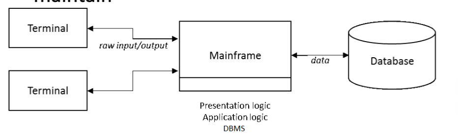
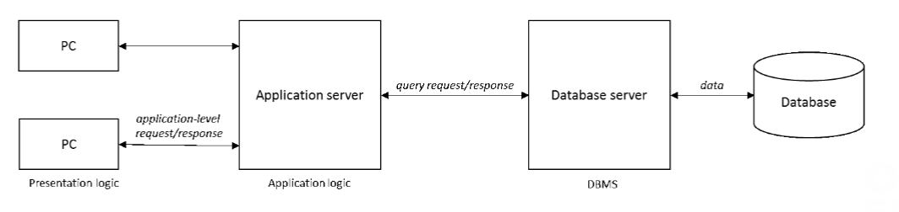
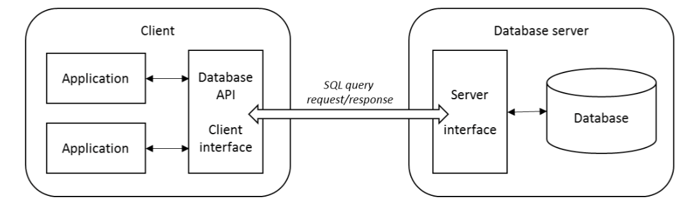
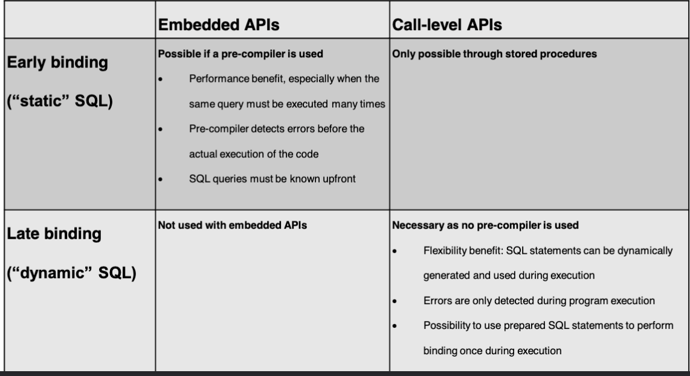
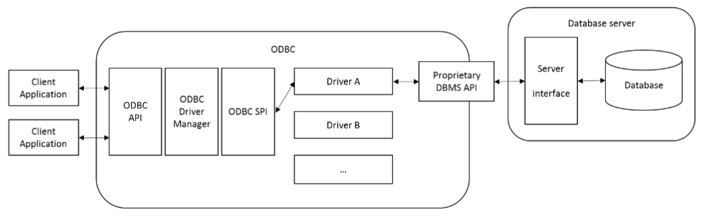
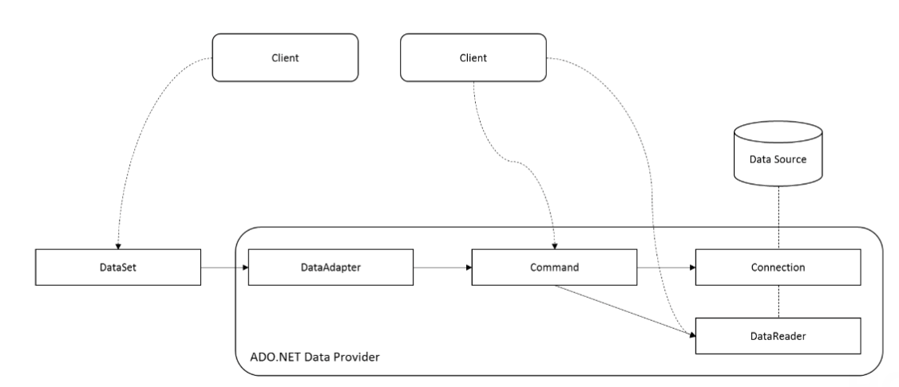
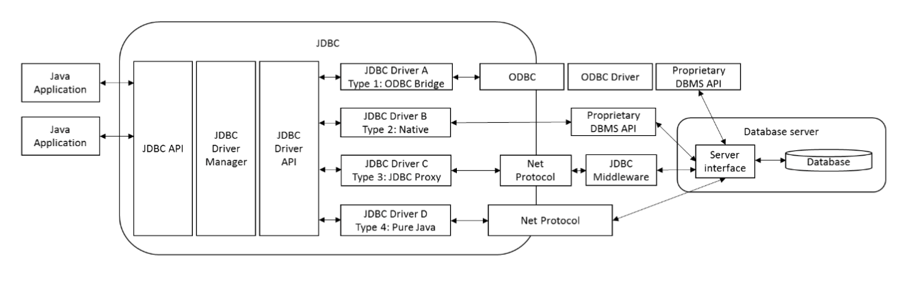

# 1. Database APIs

- [1. Database APIs](#1-database-apis)
  - [1.1 Database System Architectures](#11-database-system-architectures)
    - [Centralized System Architecture](#centralized-system-architecture)
    - [Tiered System Architectures](#tiered-system-architectures)
      - [“Fat” client variant](#fat-client-variant)
      - [“Thin” client variant](#thin-client-variant)
    - [Database System Architectures](#database-system-architectures)
  - [1.2 Database APIs](#12-database-apis)
    - [Proprietary Versus Universal APIs](#proprietary-versus-universal-apis)
    - [Embedded Versus Call-level APIs](#embedded-versus-call-level-apis)
      - [Embedded API's -\> Early binding](#embedded-apis---early-binding)
      - [Call-level API's -\> Late binding](#call-level-apis---late-binding)
    - [Early Binding Versus Late Binding](#early-binding-versus-late-binding)
    - [Universal Database APIs (ODBC, OLE DB and ADO, ADO.NET, JDBC, SQLJ)](#universal-database-apis-odbc-ole-db-and-ado-adonet-jdbc-sqlj)
      - [**ODBC** (Open Database Connectivity)](#odbc-open-database-connectivity)
      - [OLE DB (Object Linking and Embedding for DataBases) and ADO (ActiveX Data Objects)](#ole-db-object-linking-and-embedding-for-databases-and-ado-activex-data-objects)
      - [ADO.NET -\> slide 29](#adonet---slide-29)
      - [JDBC (Java Database Connectivity)](#jdbc-java-database-connectivity)
      - [SQLJ](#sqlj)
    - [Language-integrated Querying](#language-integrated-querying)
  - [1.3 Object Persistence and ORMs -\> Slide 50 trekt uw plan xoxo](#13-object-persistence-and-orms---slide-50-trekt-uw-plan-xoxo)
    - [Object Persistence with EJB](#object-persistence-with-ejb)
    - [Object Persistence with JPA](#object-persistence-with-jpa)
    - [Object Persistence with JDO](#object-persistence-with-jdo)
    - [Other Object Persistence Technologies (ActiveRecord, Entity Framework, SQLAlchemy)](#other-object-persistence-technologies-activerecord-entity-framework-sqlalchemy)
  - [Summary](#summary)
  - [1.4 Exercise in Python](#14-exercise-in-python)

## 1.1 Database System Architectures


### Centralized System Architecture

Alle veraantwoordelijkheid ligt bij een centrale server.
Zeldzaam , duur en moeilijk te onderhouden.



### Tiered System Architectures

Gericht op het ontkoppelen van de gencentraliseerde architectuur.
Combineren van de computeer kracht van de server en flexibiliteit van de client.

Meerdere varianten -> bv: two-tier (client-server)

#### “Fat” client variant

UI logica en business logica op client.
Database logica op server.

Veel zwaarder voor de client.

#### “Thin” client variant

Enkel UI logica op client.

Bussiness en database logica worden uitgevoerd op de server


### Database System Architectures

three-tier (client-server-database)

applicatie logica ontkoppeld van de database logica

Applicatieserver en databaseserver kunnen meerdere fysieke servers zijn.



## 1.2 Database APIs

Applicaties maken gebruik van API's om te communiceren met de database. Deze API's worden aangeboden door het DBMS.

API laat toe om de database te manipuleren en te bevragen.

Deze zijn meerste geimplementeerd om te werken over een computer netwerk.

Doel API?: Het blootstellen van de functionaliteit van het DBMS aan bepaalde partijen(applicaties).



### Proprietary Versus Universal APIs

DBMS leveranciers bieden hun eigen proprietary API aan.
DMBS specifiek

Nadeel: applicatie moet weten welke DBMS gebruikt wordt. (vendor lock-in) -> DBMS vervangen = applicatie herschrijven.

Hiervoor zijn generieke API's ontwikkeld die onafhankelijk zijn van het DBMS. -> makkelijk om te schakelen tussen DBMS.

### Embedded Versus Call-level APIs

#### Embedded API's -> Early binding

**Embedded API**: API is deel van de applicatie code. -> applicatie code en database code zijn 1 geheel.

- SQL precompiler

Voordelen:

- Pre-Compiler doet syntax check
- Pre-Compiler kan early binding doen -> helpt genereren van efficiente code

Nadelen:

- Moeilijker te onderhouden code

Embedded API's zijn niet populair.

Voorbeeld: SQLJ

#### Call-level API's -> Late binding

**Call-level API**: Sturen SQL instructies naar de database via directe API calls.

Voorbeeld: ODBC, Python pyodbc, ...

### Early Binding Versus Late Binding

SQL binding is het proces waarbij SQL-code wordt vertaald naar een lager niveau van representatie dat door het Database Management Systeem (DBMS) kan worden uitgevoerd. Dit proces omvat verschillende belangrijke stappen:

1. **Validatie van Tabel- en Veldnamen**: Het systeem controleert of de in de SQL-query gebruikte tabellen en velden bestaan in de database.

2. **Controle op Toegangsrechten**: Het systeem verifieert of de gebruiker of client voldoende rechten heeft om de gevraagde operatie uit te voeren.

3. **Genereren van een Queryplan**: Het DBMS stelt een plan op om de fysieke data op de meest efficiënte manier te benaderen. Dit omvat het kiezen van de beste manier om tabellen te joinen, indexen te gebruiken, en de volgorde van operaties te bepalen.

De termen "early binding" en "late binding" verwijzen naar het tijdstip waarop deze binding plaatsvindt:

1. **Early Binding**: At Compile Time

   - Gaat enkel als de API embedded is met precompiler
   - performanter
   - syntax check

2. **Late Binding**: At Runtime
   - meer flexibiliteit
   - meer kans op syntax en authorisatie fouten
   - moeilijker app testen
   - minder performant -> query plan moet elke keer opnieuw gemaakt worden



### Universal Database APIs (ODBC, OLE DB and ADO, ADO.NET, JDBC, SQLJ)

#### **ODBC** (Open Database Connectivity)

- Microsoft
- uniforme interface voor verschillende DBMS
- 4 componenten:
  - ODBC API -> call-level API -> voor de applicatie
  - ODBC Driver Manager -> moet juiste driver kiezen voor DBMBS
  - Database driver -> collectie van routines die de echte code om met de database te communiceren bevatten
  - Service Provider Interface(SPI) -> interface tussen driver manager en driver -> een soort adapter waardoor alle soorten driver kunnen gebruikt worden



Nadelen:

- Microsoft native
- C gebaseerd
- tussenlaag zorgt voor performantie verlies

#### OLE DB (Object Linking and Embedding for DataBases) and ADO (ActiveX Data Objects)

Opvolger van ODBC die uniform toegang biedt tot verschillende data bronnen met COM (Component Object Model) technologie.

Support voor object databanken, spreadsheets, ...

Probeert Universele Data Access te bieden.

ADO voorziet een programmer friendly model bovenop OLE DB.

#### ADO.NET -> slide 29

OLE DB en ADO samengevoegd.

Toegang via data providers.



#### JDBC (Java Database Connectivity)

Call-level API voor Java.

Inspireerd door ODBC

Object oriented

`database connections, drivers, queries and results 
are thus all expressed as objects, based on 
uniform interfaces and hence exposing a uniform 
set of methods, no matter which DBMS is utilized
`



Nog veel bla bla valaf slide 32

#### SQLJ

Embedded API voor Java.

precompiler:

- converteert naar java code
- doet syntax check
- parameters doorgeven met :arg
- geen compile time checking bij late bindinga parameters

Geen success:

- geen support dynamic SQL
- veel overhead voor dev

### Language-integrated Querying

Voorbeeld: jOOQ, QueryDSL, Microsoft LINQ, Python SQLAlchemy

Voordeel:

- embedded sql in pure java -> geen precompiler nodig
- code generator die database schema omzet naar java code
- deze kun je dan querying in java code
- Standaard java compiler doet syntax check

```
String sql = create.select(BOOK.TITLE, AUTHOR.NAME)
.from(BOOK)
.join(AUTHOR)
.on(BOOK.AUTHOR_ID.equal(AUTHOR.ID))
.where(BOOK.NUM_PAGES.greaterThan(100))
.getSQL();
```

## 1.3 Object Persistence and ORMs -> Slide 50 trekt uw plan xoxo

### Object Persistence with EJB

### Object Persistence with JPA

### Object Persistence with JDO

### Other Object Persistence Technologies (ActiveRecord, Entity Framework, SQLAlchemy)

Ruby on Rails -> ActiveRecord

.NET -> Entity Framework

Python -> SQLAlchemy

## Summary

| Technology                                | Embedded or Call-level            | Early or late binding               | Objects in host programming language represent                                                                                                         | Data sources                                                                          | Other                                                                                  |
| ----------------------------------------- | --------------------------------- | ----------------------------------- | ------------------------------------------------------------------------------------------------------------------------------------------------------ | ------------------------------------------------------------------------------------- | -------------------------------------------------------------------------------------- |
| JDBC                                      | Call-level                        | Late binding                        | A resultset with rows of fields                                                                                                                        | Mainly relational databases, though other structured tabular sources possible as well | Java-based technology, portable, still in wide use                                     |
| SQLJ                                      | Embedded                          | Early binding                       | A resultset with rows of fields                                                                                                                        | Relational databases supporting SQL                                                   | Java-based technology, uses a precompiler, mostly outdated                             |
| Language-integrated Query Technologies    | Uses an underlying call-level API | Uses an underlying late-binding API | A resultset with rows of fields, sometimes converted to a plain collection of objects                                                                  | Relational databases supporting SQL or other data sources                             | Examples: jOOQ and LINQ, works together with another API to convert expressions to SQL |
| OLE DB and ADO                            | Call-level                        | Late binding                        | A resultset with rows of fields                                                                                                                        | Mainly relational databases, though other structured tabular sources possible as well | Microsoft-based technology, backwards compatible with ODBC, mostly outdated            |
| ADO.NET                                   | Call-level                        | Late binding                        | A resultset with rows of fields provided by a DataReader, or a DataSet: a collection of tables, rows, and fields, retrieved and stored by DataAdapters | Various data sources                                                                  | Microsoft-based technology, backwards compatible with ODBC and OLE DB                  |
| Enterprise JavaBeans (EJB 2.0)            | Uses an underlying call-level API | Uses an underlying late-binding API | Plain Java entity Beans as the main representation                                                                                                     | Mainly relational databases, though other structured tabular sources possible as well | Java-based technology, works together with another API to convert expressions to SQL   |
| Java Persistence API (JPA in EJB 3.0)     | Uses an underlying call-level API | Uses an underlying late-binding API | Plain Java objects as the main representation                                                                                                          | Mainly relational databases, though other structured tabular sources possible as well | Java-based technology, works together with another API to convert expressions to SQL   |
| Java Database Objects (JDO)               | Uses an underlying call-level API | Uses an underlying late-binding API | Plain Java objects as the main representation                                                                                                          | Various data sources                                                                  | Java-based technology                                                                  |
| ORM APIs (ActiveRecord, Entity Framework) | Uses an underlying call-level API | Uses an underlying late-binding API | Plain objects defined in the programming language as the main representation                                                                           | Relational databases                                                                  | Various implementations available for each programming language                        |

## 1.4 Exercise in Python

Oplossing staat [Hier](./3._sqlalchemy_exercise.py)

Er staat overal een mac connectie string gelieve deze aan te passen op windows naar de juiste string


