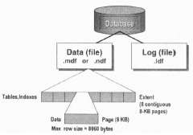

# H5 - Indexes and Performance | [BACK](../README.md)

## Space allocation by SQL Server

- Random access files
- Page → 8 kB blok aaneengesloten geheugen
- Extent → 8 logisch opeenvolgende pagina's
    - uniform extends: voor 1 DB-object
    - mixed extents: kan gedeeld worden met 8 db objecten(=tabellen, indexes, enz.)

→ een extent is een groep van 8 pagina's en een pagina is een block data van 8 kB

→ nieuwe data wordt toegevoegd aan een mixed extent



## Creation of indexes

```sql
CREATE [UNIQUE] [| NONCLUSTERED]
INDEX index_name ON table (kolom [,...n])
```

- Unique: alle waarden in de geïndexeerde kolom moeten uniek zijn
    - Kolom met unieke index mag niet null zijn
- Wanneer je een index aanmaakt kan de tabel leeg of gevuld zijn

## Removing indexes

```sql
DROP INDEX index_name ON table
```

## Table scan

- Heap
    - Niet gesorteerde collectie van data-pages
        - geen index
    - Standaard manier van opslaan tabel zonder indexen

- Toegang door Index Allocation Map
- Table scan: gaat alle pages van de tabel ophalen om door te zoeken
- Performantie probleem:
    - Fragmentatie:
        - Tabel verspreid over meerdere niet opvolgende pagina's
    - Forward pointers
        - varchar velden kunnen langer worden bij een update → een forward pointer is een verwijzing naar een andere
          pagina → **TRAAG**

1. Steek de ongesorteerde data in een tabel
    1. Zeer inefficiënt: stel je zoekt een telefoonnummer op, dan moet je alle rijen doorlopen omdat er later misschien
       nog een match is met dat nummer.
    2. Niet altijd slecht: Als je bv. veel data nodig hebt, dan is het niet zo erg dat je alles moet doorlopen.
2. Probeer de data te sorteren
    1. In een telefoon boek staan alle nummers gesorteerd op achternaam, op voornaam als er meerdere mensen dezelfde
       achternaam hebben.
    2. Dit lost het probleem niet op → soortgelijke scan maar weet nu wel waar te stoppen met zoeken

## Clustered index

- Maar 1 clustered index per tabel mogelijk → omdat de base table in de structuur zit
- Fysieke volgorde van de rijen in de tabel komt overeen met de volgorde van de index
- Boom structuur
    - Zoeken door deze boom:
        - **Clustered index seek**
        - Makkelijk navigeren door de boom naar juiste data → efficient
- Data wordt gesorteerd op de geïndexeerde kolom
- Clustered index houd de 'base table' bij in de structuur

> De bladeren van de boom zijn de base data en de knopen zijn de index data die verwijzen naar de bladeren/pages
> </br>
> _Base data is de volledige data die in de tabel staat_


- representeert de hele base data

- Voordelen i.v.m. table scan:
    - Door dubbelgelinkte lijst:
        - Geen forward pointers
        - Sequential access


## Non Clustered index

- Boom structuur
    - Zelfde structuur als clustered index, maar de base data staat niet in de structuur
        - De bladeren bevatten pointers naar de base data buiten de structuur(buiten het oranje kader)

- De base data is hier wel een heap
- Referenties naar de data werkt door RID's (row identifier):
    - Fysieke locatie van de data in de tabel
- De base data kan hier een clustered index zijn
    - Referenties is dan geen RID maar clustered index key

- Heeft zelfde zoek operaties als clustered index
    - **Non clustered index seek**
    - **Non clustered index scan**
    - Data is wel maar gedeeltelijk beschikbaar in de structuur
        - Meestal maar enkele rijen van een kolom
        - Referenties naar de base data kunnen de rest van de kolom ophalen


- fysiek andere structuur die verwijst naar de base data

- Default index
- trager dan clustered index
- > 1 per tabel toegelaten
- Forward en backward pointers
- Elk blad heeft
    - Key en value
    - RID row locator
        - om de data te localiseren in de clustered index als die er is
        - anders in de base table -> heap

- Lezen via een non-clustered index:
    - RID lookup:
        - lookups naar de heap met hun RID
    - Key lookup:
        - lookups naar een clustered index als die er is


## Filtered index

- Enkel voor non clustered indexes
- Filteren op bepaalde rijen in de tabel
    - Door where toe te voegen bij het aanmaken van de index


## INCLUDE

- Voegt data die niet in de index staat toe aan de bladeren
    - Zorgt dat je niet naar de base data moet gaan om de data op te halen


## Does my query use a table scan?


## What is the difference? Indexes!

- Wat?
    - Geordende structuur van de data
    - Snelle toegang door boomstructuur -> Balanced Tree
- Waarom?
    - sneller data ophalen
    - eenheid van rijen behouden??
- Waarom niet?
    - overhead (extra opslag)
    - Vertragen updates, inserts en deletes -> index moet ook geüpdatet worden

## Indexes: library analogy

- Slide 26 is voorbeeld

## SQL Optimizer

- Module in elke DBMS
- Analyseert en optimaliseert de query
- Kiest de beste manier om de query uit te voeren
    - Of index gebruiken of niet
- SQL Searching komt voor bij:
    - WHERE
    - JOIN
    - GROUP BY
    - ORDER BY
    - HAVING
    - JOINS

## Covering index

- Indien non-clustered nie alle data bevat, dan zal SQL server voor elke rij deze via een lookup moeten ophalen
    - Dit is trager
- non clustered index die alle kolommen bevat die je nodig hebt voor een query
    - Je kunt deze toevoegen, maar die worden niet geïndexeerd


> ```sql
> SELECT lastname FROM Employee1 WHERE lastname = 'Duffy'
> 
> SELECT lastname, title FROM Employee1 WHERE lastname = 'Duffy'
> ```
>
> 

> Oplossing -> covering index met INCLUDE
> ```sql
> create nonclustered index EmpLastName_Incl_Title
> ON Employee1(lastname) INCLUDE (title);
> ```
>
> ```sql
> SELECT lastname FROM Employee1 WHERE lastname = 'Duffy'
>
> SELECT lastname, title FROM Employee1 WHERE lastname = 'Duffy'
> ```
>
> 

## 1 index with several columns vs several indexes with 1 column

```sql
CREATE NONCLUSTERED INDEX EmpLastName ON Employee1(lastname);

+

CREATE NONCLUSTERED INDEX EmpFirstname ON Employee1(firstname);

OR?

CREATE NONCLUSTERED INDEX EmpLastNameFirstname ON Employee1(lastname, firstname);
```

> ```sql
> SELECT lastname, firstname FROM Employee1
> WHERE firstname = 'Chris';
> ```
> 

> ```sql
> -- Test: Only combined index on lastname and firstname
>
> DROP INDEX EmpLastName ON Employee1;
> 
> SELECT lastname, firstname FROM Employee1
> WHERE lastname = 'Preston'
>
> SELECT lastname, firstname FROM Employee1
> WHERE firstname = 'Chris';
> ```
> 

> ```sql
> -- With extra index on firstname and covering of lastname
> create nonclustered index EmpFirstnameIncLastname
> ON employee1(firstname)
> INCLUDE (lastname);
> 
> SELECT lastname, firstname FROM Employee1
> WHERE lastname = 'Preston'
> 
> SELECT lastname, firstname FROM Employee1
> WHERE firstname = 'Chris';
> ```
> 

## Use of indexes with functions and wildcards

> ```sql
> SELECT lastname, firstname
> FROM Employee1
> WHERE lastname = 'Preston'
> 
> SELECT lastname, firstname
> FROM Employee1
> SUBSTRING(lastname, 2, 1) = 'r'
> 
> SELECT lastname, firstname
> FROM Employee1
> WHERE lastname LIKE '%r%'
> ```
> 

## Index seek vs Index scan

- Index seek
    - Boom structuur van de index wordt gebruikt voor snel data te vinden
- Index scan
    - Index wordt gebruikt om te scannen van start tot aan de juiste data

## When to use an index?

- Welke kolom indexeren?
    - Primairy key en unieke kolommen zijn automatisch geïndexeerd
    - Foreign keys die je vaak gebruikt bij joins
    - Kolommen die je veel gebruikt in zoekopdrachten (WHERE, GROUP BY, HAVING)
    - Kolommen die je veel gebruikt in sorteringen (ORDER BY)
- Welke kolommen niet?
    - kolommen die nooit gebruikt worden in zoekopdrachten
    - Kolommen met kleine mogelijkheden (ja/nee, true/false, 1/0, man/vrouw)
    - Kolommen in kleine tabellen
    - Kolommen met type bit, text, images

## Tips & Tricks

> Vermijd gebruik van functies
> ```sql
> -- BAD
> SELECT FirstName, LastName, Birthdate
> FROM Employee1
> WHERE Year(BirthDate) = 1980;
> 
> -- GOOD
> SELECT FirstName, LastName, Birthdate
> FROM Employee1
> WHERE BirthDate >= '1980-01-01' AND
> BirthDate < '1981-01-01';
> ```
> 
>
> ---
> ```sql
> -- BAD
> SELECT LastName
> FROM Employee1
> substring(LastName,1,1) = 'D';
> 
> -- GOOD
> SELECT LastName
> FROM Employee1
> WHERE LastName like 'D%';
> ```
> 

> Vermijd berekeningen op kolommen
> ```sql
> -- BAD
> SELECT EmployeeID, FirstName, LastName
> FROM Employee1
> WHERE Salary*1.10 > 100000;
> 
> -- GOOD
> SELECT EmployeeID, FirstName, LastName
> FROM Employee1
> WHERE Salary > 100000/1.10;
> ```
> 

> OUTER JOIN is beter dan UNION
> ```sql
> -- BAD
> SELECT lastname, firstname, orderid
> FROM Employee1 e JOIN Orders o on e.EmployeeID = o.employeeid
> UNION
> SELECT lastname, firstname, null
> FROM Employee1
> WHERE EmployeeID NOT IN (select EmployeeID from Orders)
> 
> -- GOOD
> SELECT lastname, firstname, orderid
> FROM Employee1 e LEFT JOIN Orders o on e.EmployeeID = o.employeeid;
> ```
> 

> Vermijd AND en ALL
> ```sql
> -- BAD
> SELECT lastname, firstname, birthdate
> FROM Employee1
> WHERE BirthDate >= all(SELECT BirthDate from Employee1)
>
> -- GOOD
> SELECT lastname, firstname, birthdate
> FROM Employee1
> WHERE BirthDate = (SELECT max(BirthDate) from Employee1)
> ```
> 