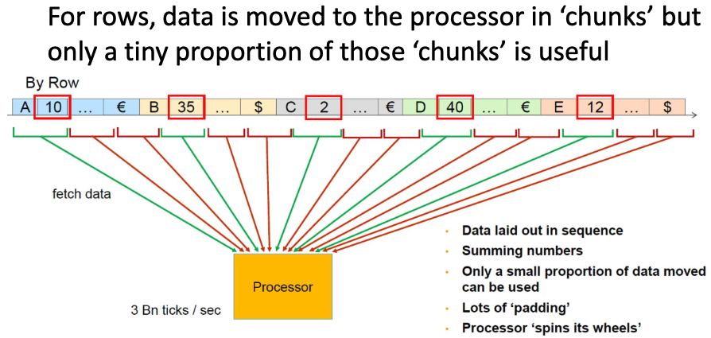
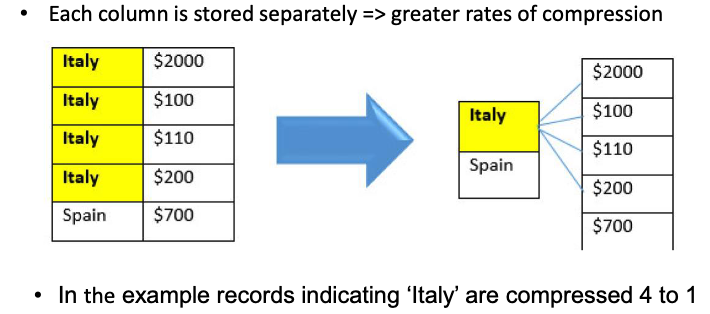

# 2.2 In Memory Databases

- [2.2 In Memory Databases](#22-in-memory-databases)
  - [2.2.1. In-memory database technology](#221-in-memory-database-technology)
    - [Hardware revolution](#hardware-revolution)
    - [In-memory database technology](#in-memory-database-technology)
    - [Storing tabular data: two ways](#storing-tabular-data-two-ways)
  - [2.2.2. Commercial In-memory Databases (slide 17)](#222-commercial-in-memory-databases-slide-17)
  - [2.2.3. SQL Server Memory Optimized Tables](#223-sql-server-memory-optimized-tables)
  - [2.2.4. Exercise](#224-exercise)

## 2.2.1. In-memory database technology

### Hardware revolution

Vroeger waren servers niet uitgerust met veel geheugen. -> geen mogelijkheid veel in-memory databases te gebruiken.

Tegenwoordig hebben servers een behoorlijke hoeveelheid CPU kracht en geheugen. -> in-memory databases zijn beter mogelijk

### In-memory database technology

Systeem geheugen -> veel sneller dan disk

Als een programma iets vaak gebruikt zal het gecached worden in de CPU L1, L2 cache. -> nog sneller 10x dan systeem geheugen

Disk snelheiden zijn heel slecht in random access.

In-memory databases -> data in systeem geheugen (RAM) houden.

Zo is er geen tijd nodig om data van disk te halen. CPU kan direct aan de data.

Voordelen:

- Snelle updates
- Snelle inserts
- Snel lezen van data

Nadelen:

- Elektriek gone? -> data gone
- Kost -> ram veel duurder dan disk opslag

### Storing tabular data: two ways

- Row based
  - 
- Column based
  - elke kolom wordt apart opgeslagen -> apparte index
  - zo kun je delen van bepaalde colommen die niet nodig zijn in een query weglaten
  - Voordelen:
    - Comprest goed
    - waarden voor aggregatie direct beschikbaar
    - makkelijk nieuwe kolommen toevoegen
    - enkel nodige kolomen laden voor een query
    - optimaal gebruik cpu architectuur
  - Compressie
    - Elke db technologie gebruikt compressie
    - zorgt voor overhead
    - update in een database block -> overhead
      - uncompress -> update -> compress

Column based is enkel goed voor in-memory databases.
Heeft snellere access
Minder data size -> door compression

## 2.2.2. Commercial In-memory Databases (slide 17)

SAP Hana

Oracle IM (in-memory)

Microsoft "memory optimized tables"

## 2.2.3. SQL Server Memory Optimized Tables

Microsoft zeft performance stonks 30x sneller.

snel omdat geoptimaliseerd voor in-memory

Faill-safe -> data loggen naar disk
bij de commit van een transactie

Use cases:

- High troughput en low latency
  - Stock trading, sports betting, online gaming
- Data ingest -> bij grote vollumes van verschillende bronnen
  - IoT, real-time analytics
- Caching en session state
  - ASP.NET session state, ASP.NET output cache
- Vervangen van tempdb
  - tempdb is een database die gebruikt wordt voor tijdelijke data
  - memory optimized tables kunnen tempdb vervangen
- ETL -> extract, transform, load
  - ETL workflows often include load of data into a staging table transformations of the data, and load into the final tables.
  - Use non-durable memory-optimized tables (option:DURABILITY=SCHEMA_ONLY) for the data staging. They completely remove all IO, and make data access more efficient.

[ZIE SCRIPT](./4._MemoryOptimizedTables.sql)

- Beperkingen
  - Geen clustered index
  - geen berekende columns
  - Geen ROWGUIDCOL
  - `Tables that are migrated to memory can’t have foreign key relationships with other tables, so they first have to be removed. Foreign key relationships also can’t be restored after migration of a single table, so in practice often the complete database has to be migrated to memory if you want to restore foreign keys if all tables areconnected through foreign keys.` -> wathever dit is

## 2.2.4. Exercise

Database xtreme

- Migrate table Supplier to memory in a durable way.
- Describe the different steps
- Check the result
