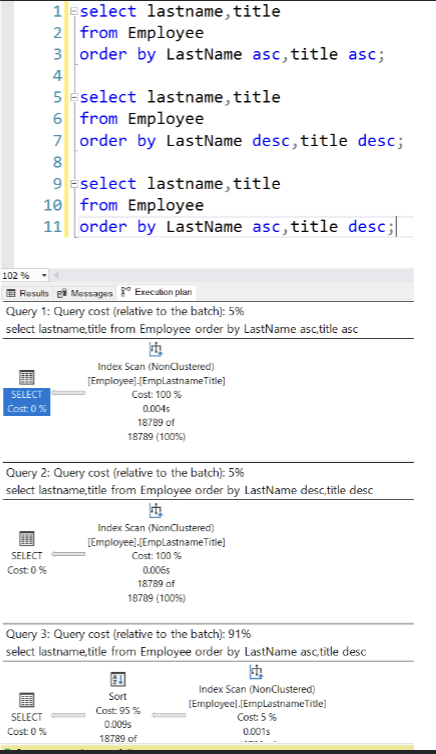

# 2.1 SQL Server Advanced Performance

- [2.1 SQL Server Advanced Performance](#21-sql-server-advanced-performance)
  - [2.1.1. Introduction](#211-introduction)
    - [Space allocation by SQL Server](#space-allocation-by-sql-server)
  - [2.1.2. Clustered \& Non-clustered Indexes](#212-clustered--non-clustered-indexes)
    - [Table scan](#table-scan)
    - [INDEXES](#indexes)
    - [SQL Optimizer](#sql-optimizer)
    - [Clustered index](#clustered-index)
    - [Non-clustered index](#non-clustered-index)
    - [Use of indexes with functions and wildcards](#use-of-indexes-with-functions-and-wildcards)
  - [2.1.3. Covering Indexes](#213-covering-indexes)
    - [Covering index: example (db xtreme with script EmployeeIdx)](#covering-index-example-db-xtreme-with-script-employeeidx)
    - [Use of indexes with functions and wildcards](#use-of-indexes-with-functions-and-wildcards-1)
  - [2.1.4. Concatenated Indexes](#214-concatenated-indexes)
    - [1 index with several columns vs. several indexes with 1 column](#1-index-with-several-columns-vs-several-indexes-with-1-column)
    - [Sort order with concatenated indexes](#sort-order-with-concatenated-indexes)
  - [2.1.5. Working with Indexes](#215-working-with-indexes)
    - [Creation of indexes](#creation-of-indexes)
    - [Removing indexes](#removing-indexes)
    - [When to use an index](#when-to-use-an-index)
    - [Looking for "expensive" queries](#looking-for-expensive-queries)
  - [2.1.6. Rules of Thumb](#216-rules-of-thumb)
  - [2.1.8. Materialized Views (Indexed Views)](#218-materialized-views-indexed-views)
    - [Indexed views: benefits](#indexed-views-benefits)
    - [Indexed views: restrictions](#indexed-views-restrictions)
    - [Indexed views: schema binding](#indexed-views-schema-binding)
    - [Indexed view: example](#indexed-view-example)
  - [2.1.9. Index Statistics](#219-index-statistics)
    - [Index usage statistics](#index-usage-statistics)
  - [2.1.10. Storage \& Partitions](#2110-storage--partitions)
    - [Storage: files \& filegroups](#storage-files--filegroups)
    - [Storage: examples](#storage-examples)
    - [Storage: conclusions](#storage-conclusions)
    - [Partitioning](#partitioning)
    - [Create table in filegroup](#create-table-in-filegroup)
    - [Create index in filegroup](#create-index-in-filegroup)
    - [Partitioning](#partitioning-1)
    - [Partitions: example (db stackoverflow)](#partitions-example-db-stackoverflow)

## 2.1.1. Introduction

Performance is important

### Space allocation by SQL Server

- Random access files
- Page → 8 kB blok aaneengesloten geheugen
- Extent → 8 logisch opeenvolgende pagina's
  - uniform extends: voor 1 DB-object
  - mixed extents: kan gedeeld worden met 8 db objecten(=tabellen, indexes, enz.)

→ een extent is een groep van 8 pagina's en een pagina is een block data van 8 kB

→ nieuwe data wordt toegevoegd aan een mixed extent

## 2.1.2. Clustered & Non-clustered Indexes

### Table scan

- Heap

  - Niet gesorteerde collectie van data-pages
    - geen index
  - Standaard manier van opslaan tabel zonder indexen

- Toegang door Index Allocation Map
- Table scan: gaat alle pages van de tabel ophalen om door te zoeken
- Performantie probleem:
  - Fragmentatie:
    - Tabel verspreid over meerdere niet opvolgende pagina's
  - Forward pointers
    - varchar velden kunnen langer worden bij een update → een forward pointer is een verwijzing naar een andere
      pagina → **TRAAG**

### INDEXES

Index -> gesorteerde collectie records van een tabel -> snelle toegang door boomstructuur (Balanced Tree)

Waarom?

- Performantie

Waarom niet?

- Indexen pakken redelijk veel plaats in
- Vertragen DML operaties (insert, update, delete)

### SQL Optimizer

- Kiest de beste manier om een query uit te voeren
- Zet een query om in een executie plan (compiling of parsing)
- 2 soorten:
  - Cost based optimizer
    - meerdere plannen worden gegenereerd en het minst kostende plan wordt gekozen
  - Rule based optimizer
    - vooropgestelde regels bepalen de beste manier om een query uit te voeren

Executie plannen worden gecached


### Clustered index

- Fysieke volgorde van de data in de tabel is gelijk aan de volgorde van de index
- 1 clustered index per tabel
- Voordelen:
  - dubbel-gelinkte lijst -> sequential access
  - geen forward pointers
- bladeren zijn de data pagina's

### Non-clustered index

- standaard index
- trager dan clustered
- meer dan 1 per tabel
- forward en backward pointers tussen de bladeren
- bladeren verwijzen naar de data pagina's
- Elk blad heeft

  - Key en value
  - RID row locator
    - om de data te localiseren in de clustered index als die er is
    - anders in de base table -> heap

Als er meer velden van een tabel nodig zijn die niet in de index zitten dan

- Lezen via een non-clustered index:
  - RID lookup:
    - lookups naar de heap met hun RID
  - Key lookup:
    - lookups naar een clustered index als die er is

### Use of indexes with functions and wildcards

Indexen die gebruik maken van een wildcard in het begin van de zoekterm kunnen niet gebruikt worden

je kan wel dat veld includen in de index

## 2.1.3. Covering Indexes

- ALs een non-clustered index niet alle velden bevat die nodig zijn voor een query dan moet SQL Server een lookup doen voor elke rij om de ontbrekende velden op te halen

- Converging index -> non-clustered index die alle velden bevat die nodig zijn voor een query

### Covering index: example (db xtreme with script EmployeeIdx)

Slide 25

### Use of indexes with functions and wildcards

Slide 28

## 2.1.4. Concatenated Indexes

### 1 index with several columns vs. several indexes with 1 column

Welke index je gebruikt hangt af van de query die je het meest zal gebruiken en welke velden je mee zal queryen

Nog veel bla bla slide 30

### Sort order with concatenated indexes

- Indexen kunne in omgekeerde richting gebruikt worden maar je kunt niet de volgorde van 2 velden mixen

bv:

```sql
CREATE NONCLUSTERED INDEXEmpLastnameTitle ON Employee
(
 LastName ASC,
 Title ASC
)
```


Bij de laatste query hebben ze asc en desc gemixed en dat kan niet

## 2.1.5. Working with Indexes

### Creation of indexes

```sql
CREATE [UNIQUE] [| NONCLUSTERED]
INDEX index_name ON table (kolom [,...n])
```

- Unique: alle waarden in de geïndexeerde kolom moeten uniek zijn
  - Kolom met unieke index mag niet null zijn
- Wanneer je een index aanmaakt kan de tabel leeg of gevuld zijn

### Removing indexes

```sql
DROP INDEX index_name ON table
```

### When to use an index

- Welke kolom indexeren?
  - Primairy key en unieke kolommen zijn automatisch geïndexeerd
  - Foreign keys die je vaak gebruikt bij joins
  - Kolommen die je veel gebruikt in zoekopdrachten (WHERE, GROUP BY, HAVING)
  - Kolommen die je veel gebruikt in sorteringen (ORDER BY)
- Welke kolommen niet?
  - kolommen die nooit gebruikt worden in zoekopdrachten
  - Kolommen met kleine mogelijkheden (ja/nee, true/false, 1/0, man/vrouw)
  - Kolommen in kleine tabellen
  - Kolommen met type bit, text, images

### Looking for "expensive" queries

## 2.1.6. Rules of Thumb

Slide 43 en verder best practices

## 2.1.8. Materialized Views (Indexed Views)

View -> Opgeslagen query statement (niet de data)

Een view kan gematerialiseerd worden door een unieke clustered index toe te voegen
Deze view wordt zo opgeslagen op de disk

Indexed view of materialized view

Hierop kun je dan weet nonclustered indexes maken

### Indexed views: benefits

- Aggregaties kunnen op voorhand berekend worden
- Tabellen op voorhand joinen als 1 tabel

### Indexed views: restrictions

Slide 78 derest trekt uw plan

### Indexed views: schema binding

### Indexed view: example

## 2.1.9. Index Statistics

### Index usage statistics

Irelevant

## 2.1.10. Storage & Partitions

### Storage: files & filegroups

- Elke database heeft minstens 2 files
  - Data file (.mdf)
  - Log file (.ldf)
  - mogelijks extra data files (.ndf)
- Filegroup
  - logische groep van files voor administratieve doeleinden
  - normaal 1 filegroup per db-file

Performantie verbeteren door filegroups:

- Filegroups op verschillende schijven plaatsen
- Data files en non-clustered indexes op verschillende disks (clustered index is een data file)
- Log bestanden op aparte schijf voor data veiligheid

Verplaatsen van een tabel naar andere filegroup:

- Drop huidige clustered index
- Maak nieuwe clustered index aan op de gewenste filegroup

### Storage: examples

```sql
REATE TABLE dbo.SmallRows
(
Id int NOT NULL,
LastName nchar(50) NOT NULL,
FirstName nchar(50) NOT NULL,
MiddleName nchar(50) NULL
);
INSERT INTO dbo.SmallRows
(
Id,
LastName,
FirstName,
MiddleName
)
SELECT
BusinessEntityID,
LastName,
FirstName,
MiddleName
FROM Person.Person;


SELECT sys.fn_PhysLocFormatter(%%physloc%%) AS [Row_Locator],
Id FROM dbo.SmallRows;
```


```sql
CREATE TABLE dbo.LargeRows
(
Id int NOT NULL,
LastName nchar(600) NOT NULL,
FirstName nchar(600) NOT NULL,
MiddleName nchar(600) NULL
);
INSERT INTO dbo.LargeRows
(
Id,
LastName,
FirstName,
MiddleName
)
SELECT
BusinessEntityID,
LastName,
FirstName,
MiddleName
FROM Person.Person;

SELECT sys.fn_PhysLocFormatter(%%physloc%%) AS [Row_Locator],
Id FROM dbo.LargeRows;
```


### Storage: conclusions

- Opslag is goedkoop maar het datatype heeft een grote impact op IO

- Denk na over data type en lengte bij het ontwerpen van een tabel

### Partitioning

Partitioneering zorgt ervoor dat een tabel of index opgedeeld wordt in meerdere delen zodat denkel de nodige delen opgehaald moeten worden

BV: tijdsgebonden data van payrol of accounting alle histroriek is meestal niet nodig

### Create table in filegroup

```sql
--Disk-Based CREATE TABLE Syntax
CREATE TABLE
    [ database_name . [ schema_name ] . | schema_name . ] table_name
    [ AS FileTable ]
    ( { <column_definition> | <computed_column_definition>
        | <column_set_definition> | [ <table_constraint> ]
| [ <table_index> ] [ ,...n ] } )
    [ ON { partition_scheme_name ( partition_column_name ) | filegroup
        | "default" } ]
    [ { TEXTIMAGE_ON { filegroup | "default" } ]
    [ FILESTREAM_ON { partition_scheme_name | filegroup
        | "default" } ]
    [ WITH ( <table_option> [ ,...n ] ) ]
[ ;
```

-> CHATGPT is toch duidelijker whi

Creating a table within a specific filegroup in SQL Server involves specifying the filegroup during the table creation process. Here's a basic example of how to do this:

1. **First, ensure the filegroup exists in your database**. You can create a new filegroup by using the `ALTER DATABASE` statement. For example:

   ```sql
   ALTER DATABASE YourDatabaseName
   ADD FILEGROUP YourFileGroupName;
   ```

   And then add at least one file to the filegroup:

   ```sql
   ALTER DATABASE YourDatabaseName
   ADD FILE (
       NAME = 'YourFileName',
       FILENAME = 'path_to_your_file.ndf' -- Specify the path
   ) TO FILEGROUP YourFileGroupName;
   ```

2. **Create a table on the specified filegroup**. When creating a table, you can specify the filegroup for the table or its indexes using the `ON` clause. Here's an example:

   ```sql
   CREATE TABLE YourTableName
   (
       Column1 DataType,
       Column2 DataType,
       ...
   )
   ON YourFileGroupName;
   ```

   In this script, `YourTableName` is the name of the table you're creating, `Column1`, `Column2`, etc., are the columns of your table, and `DataType` represents the data type of each column.

Remember to replace `YourDatabaseName`, `YourFileGroupName`, `YourFileName`, `YourTableName`, and the column definitions with the actual names and specifications relevant to your database.

This approach is used typically for large databases to distribute the data across multiple disks for performance optimization. Filegroups can also be used for administrative, data allocation, and backup and restore strategies.

### Create index in filegroup

```sql
CREATE [ UNIQUE ] [ CLUSTERED | NONCLUSTERED ] INDEX index_name
 ON <object> ( column [ ASC | DESC ] [ ,...n ] )
 [ INCLUDE ( column_name [ ,...n ] ) ]
 [ WHERE <filter_predicate> ]
 [ WITH ( <relational_index_option>  [ ,...n ] ) ]
 [ ON { partition_scheme_name ( column_name )
  | filegroup_name
  | default } ]
  [ FILESTREAM_ON { filestream_filegroup_name | partition_scheme_name | "NULL" } ]
[ ;
```

CHATGPT :chad:

Creating an index on a specific filegroup in SQL Server involves specifying the filegroup during the index creation process. This approach is often used for performance optimization, particularly in larger databases. Here's how you can create an index on a specific filegroup:

1. **Ensure the Filegroup Exists**: First, make sure the filegroup you want to use already exists in your database. If it doesn't, you need to create it as I described in the previous message.

2. **Create an Index on the Specific Filegroup**: You can specify the filegroup when creating an index using the `ON` clause. Here is a basic example:

   ```sql
   CREATE NONCLUSTERED INDEX IndexName
   ON YourTableName (ColumnName)
   ON YourFileGroupName;
   ```

   - `IndexName` is the name you want to give to your new index.
   - `YourTableName` is the name of the table on which you are creating the index.
   - `ColumnName` is the name of the column or columns you are indexing.
   - `YourFileGroupName` is the name of the filegroup where you want to place the index.

   You can replace `NONCLUSTERED` with `CLUSTERED` if you want to create a clustered index, but remember that a table can only have one clustered index.

This structure allows you to control where the physical data for the index is stored, which can be important for optimizing query performance, especially in large-scale or high-transaction databases.

Remember to replace `IndexName`, `YourTableName`, `ColumnName`, and `YourFileGroupName` with the actual names relevant to your database. Also, always consider the impact of new indexes on your database's performance, both in terms of query speed and insert/update/delete operations.

### Partitioning

Elke partitie een appate file of filegroup

Oudere en minder gebruikte data worden gesplits van de actuele data

### Partitions: example (db stackoverflow)

[HIER](./1b._Partitioning.sql)

Nog voorbeeldje:

```sql
-- Assuming YourDatabaseName is your database name

-- Create filegroups for each month
ALTER DATABASE [YourDatabaseName] ADD FILEGROUP FG_SalesData_2020_01;
ALTER DATABASE [YourDatabaseName] ADD FILEGROUP FG_SalesData_2020_02;
-- ... Continue for each month up to December 2021

-- Add file for each filegroup (modify the path as needed)
ALTER DATABASE [YourDatabaseName]
ADD FILE (
  NAME = N'Partition2020_01',
  FILENAME = N'C:\SQLData\Partition2020_01.ndf',
  SIZE = 10MB,
  FILEGROWTH = 5MB
) TO FILEGROUP FG_SalesData_2020_01;

ALTER DATABASE [YourDatabaseName]
ADD FILE (
  NAME = N'Partition2020_02',
  FILENAME = N'C:\SQLData\Partition2020_02.ndf',
  SIZE = 10MB,
  FILEGROWTH = 5MB
) TO FILEGROUP FG_SalesData_2020_02;

-- ... Continue adding files for each month up to December 2021

-- Create partition function
CREATE PARTITION FUNCTION pf_SalesDataMonthly (datetime)
AS RANGE RIGHT FOR VALUES (
  '2020-01-01', '2020-02-01', '2020-03-01', '2020-04-01', '2020-05-01', '2020-06-01',
  '2020-07-01', '2020-08-01', '2020-09-01', '2020-10-01', '2020-11-01', '2020-12-01',
  '2021-01-01', '2021-02-01', '2021-03-01', '2021-04-01', '2021-05-01', '2021-06-01',
  '2021-07-01', '2021-08-01', '2021-09-01', '2021-10-01', '2021-11-01', '2021-12-01'
);

-- Create partition scheme
CREATE PARTITION SCHEME ps_SalesDataMonthly
AS PARTITION pf_SalesDataMonthly
TO (
  FG_SalesData_2020_01, FG_SalesData_2020_02, ..., FG_SalesData_2021_12
);

-- Create the SalesData table
DROP TABLE IF EXISTS SalesData;

CREATE TABLE SalesData
(
  SaleId INT IDENTITY PRIMARY KEY,
  SaleDate DATETIME,
  Amount MONEY
) ON ps_SalesDataMonthly (SaleDate);

```

Verschilde partition functions:

1. **Range Partitioning (Yearly) - DATE/TIME Column**:

   ```sql
   CREATE PARTITION FUNCTION pf_YearlyPartition (datetime)
   AS RANGE RIGHT FOR VALUES ('2020-01-01', '2021-01-01', '2022-01-01', ...);
   ```

   This partitions data based on years. For example, all data with a date in 2020 goes into one partition, 2021 in another, and so on.

2. **Range Partitioning (Monthly) - DATE/TIME Column**:

   ```sql
   CREATE PARTITION FUNCTION pf_MonthlyPartition (datetime)
   AS RANGE RIGHT FOR VALUES ('2020-01-01', '2020-02-01', '2020-03-01', ...);
   ```

   This is similar to the yearly partition, but it breaks down data by months.

3. **List Partitioning - INTEGER Column**:

   ```sql
   CREATE PARTITION FUNCTION pf_ListPartition (int)
   AS RANGE RIGHT FOR VALUES (1, 2, 3, 4, 5, 6, 7, 8, 9, 10, ...);
   ```

   This is useful for partitioning based on specific integer values, such as status codes, categories, or other discrete numeric values.

4. **Range Partitioning - DECIMAL Column (e.g., for monetary values)**:

   ```sql
   CREATE PARTITION FUNCTION pf_RangeDecimalPartition (decimal(10, 2))
   AS RANGE RIGHT FOR VALUES (100.00, 500.00, 1000.00, ...);
   ```

   This partitions data based on a range of decimal values, like price or amount ranges.

5. **Range Partitioning - BIGINT Column (e.g., for large numeric identifiers)**:

   ```sql
   CREATE PARTITION FUNCTION pf_RangeBigIntPartition (bigint)
   AS RANGE RIGHT FOR VALUES (1000000, 2000000, 3000000, ...);
   ```

   Ideal for partitioning large datasets based on bigint identifier values, such as very large user IDs or transaction numbers.

6. **Range Partitioning (Custom) - VARCHAR Column**:
   ```sql
   CREATE PARTITION FUNCTION pf_RangeVarcharPartition (varchar(50))
   AS RANGE RIGHT FOR VALUES ('A', 'F', 'K', 'P', ...);
   ```
   This can be used for alphabetical range partitions or other string-based categorizations.

Nog een ander voorbeeld van partitioning:

1. **Creating Filegroups**:

```sql
ALTER DATABASE YourDatabase ADD FILEGROUP FG_Partition1;
ALTER DATABASE YourDatabase ADD FILEGROUP FG_Partition2;
```

2. **Adding Files to Filegroups**:

   ```sql
   ALTER DATABASE YourDatabase
   ADD FILE (
       NAME = N'Partition1File',
       FILENAME = 'C:\Data\Partition1File.ndf',
       SIZE = 100MB
   ) TO FILEGROUP FG_Partition1;

   ALTER DATABASE YourDatabase
   ADD FILE (
       NAME = N'Partition2File',
       FILENAME = 'D:\Data\Partition2File.ndf',
       SIZE = 100MB
   ) TO FILEGROUP FG_Partition2;
   ```

3. **Creating Partition Function and Scheme**:

   ```sql
   CREATE PARTITION FUNCTION MyPartitionFunction (int)
   AS RANGE LEFT FOR VALUES (1000, 2000);

   CREATE PARTITION SCHEME MyPartitionScheme
   AS PARTITION MyPartitionFunction
   TO (FG_Partition1, FG_Partition2, [PRIMARY]);
   ```

4. **Creating a Partitioned Table**:

```sql
CREATE TABLE MyPartitionedTable (
    Id int,
    Data varchar(100)
) ON MyPartitionScheme (Id);
```
