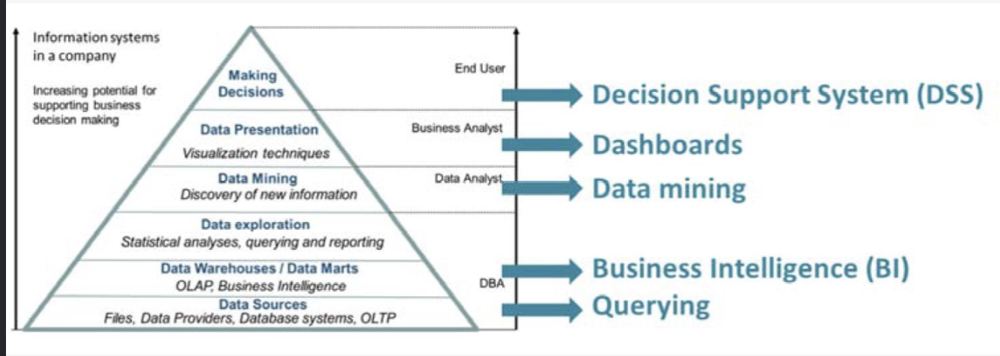
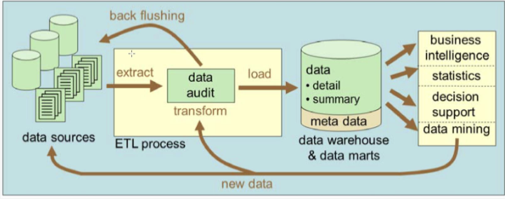
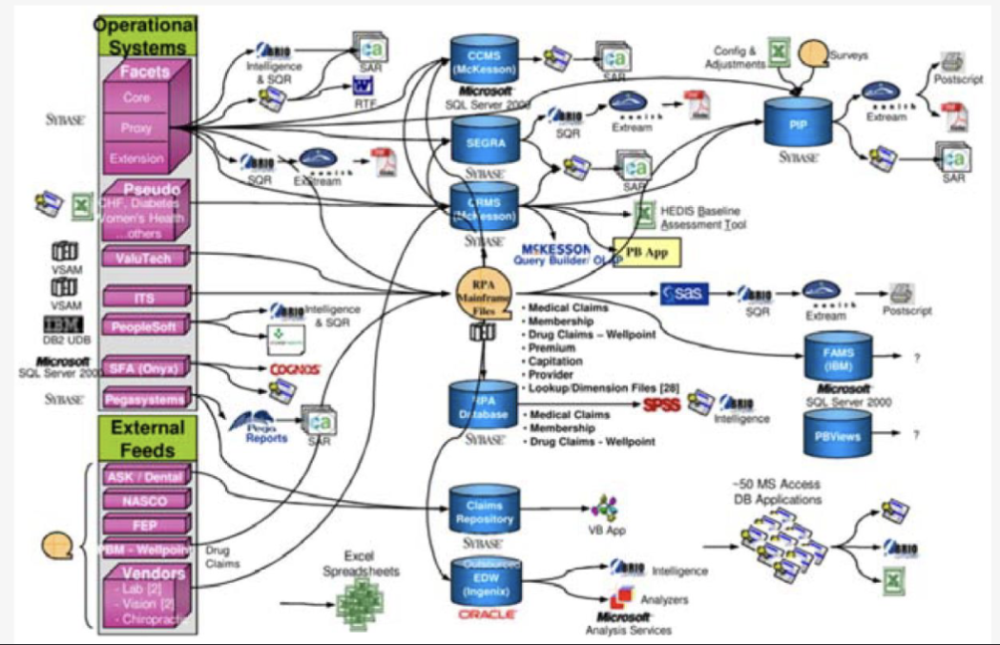

# 3.1. Big Data

- [3.1. Big Data](#31-big-data)
  - [3.1.1. Information Management](#311-information-management)
    - [Decision Support System (DSS)](#decision-support-system-dss)
    - [Traditional systems](#traditional-systems)
    - [What do users want?](#what-do-users-want)
    - [What do we usally have? in theory](#what-do-we-usally-have-in-theory)
    - [What do we usally have? in practice](#what-do-we-usally-have-in-practice)
    - [How does Big Data fit in these pictures?](#how-does-big-data-fit-in-these-pictures)
  - [3.1.2. What are big data?](#312-what-are-big-data)
    - [Big Data: Just the next hype or reality?](#big-data-just-the-next-hype-or-reality)
    - [Definitie van johaneke](#definitie-van-johaneke)
  - [3.1.3. The origin of big data](#313-the-origin-of-big-data)
    - [IoT](#iot)
  - [3.1.4. The 4 V's of big data](#314-the-4-vs-of-big-data)
  - [3.1.5. Some other V's](#315-some-other-vs)
  - [3.1.6. Bottlenecks](#316-bottlenecks)
  - [3.1.7. Usages](#317-usages)

## 3.1.1. Information Management

Data wordt opgehaald uit een **data bron** -> wordt verwerkt -> wordt verstuurd naar een user interface.

### Decision Support System (DSS)

- **Decusion Support System**
  - computer programma dat helpt bij het nemen van beslissingen
  - binnen een organisatie
  - analyseert (grote hoeveelheden) data
  - presenteerd de best mogelijke beschikbare opties

### Traditional systems

OLTTP = Online Transaction Processing -> korte termijn beslissingen
OLAP = Online Analytical Processing -> middelange en lange termijn beslissingen

### What do users want?

Alle data op 1 logische databse voor analyses: het lijkt dat alle data beschikbaar is vanuit 1 database

### What do we usally have? in theory

Theoretisch wordt de data van verschillende system opgehaald en getransformeerd naar een correct fomaat waarna het naar een Datawarehouse wordt gestuurd voor gemakkelijke BI (Business Intelligence) analyses.

### What do we usally have? in practice

In realiteit is het veel complexer process.

### How does Big Data fit in these pictures?

Croissant? -> Traditionele systemen zijn niet in staat om de grote hoeveelheden data te verwerken. Verder meer details.

## 3.1.2. What are big data?

- Veel verschillende definities -> CONFUSION 🤔

### Big Data: Just the next hype or reality?

-> Was altijd veel besproken

### Definitie van johaneke

> “Data that is not (consciously) entered by a user but
> that arise, often spontaneously, as a by-product of
> other processes and that are (usually) used for purposes
> for which they were not originally intended”

## 3.1.3. The origin of big data

Door internet, sociale media, IoT, ... is er een grote hoeveelheid random data beschikbaar. Met verschillende karakteristieken. -> brengt uitdagingen met zich mee.

> "Der blijft data bijkomen dus moet er altijd vernieuwd worden?
> de big data van vandaag is niet de big data van morgen"
>
> door Lucca

### IoT

Internet of Things -> alles is verbonden met het internet. -> sensors, camera's, ... -> extra data -> BIG DATA

## 3.1.4. The 4 V's of big data

## 3.1.5. Some other V's

## 3.1.6. Bottlenecks

## 3.1.7. Usages
