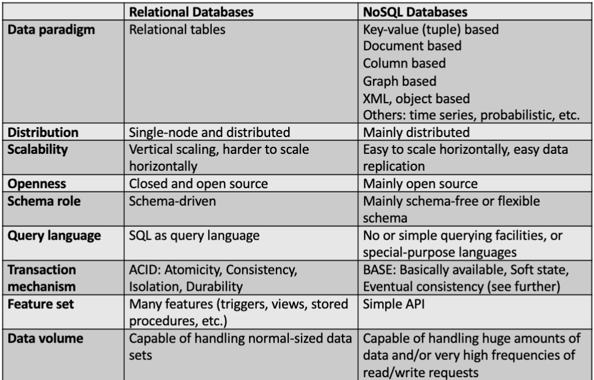

# 3.2. Introduction to NoSQL

- [3.2. Introduction to NoSQL](#32-introduction-to-nosql)
  - [3.2.1. Classical relational databases follow the ACID rules](#321-classical-relational-databases-follow-the-acid-rules)
  - [3.2.2. The NoSQL movement](#322-the-nosql-movement)
    - [Vertical vs Horizontal scaling](#vertical-vs-horizontal-scaling)
  - [Terug naar de NoSQL movement](#terug-naar-de-nosql-movement)
  - [3.2.4. NoSQL what does it mean?](#324-nosql-what-does-it-mean)
  - [3.2.5. Limitations of NoSQL](#325-limitations-of-nosql)
  - [3.2.6. Independance mismatch](#326-independance-mismatch)

## 3.2.1. Classical relational databases follow the ACID rules

- **ACID**
  - Atomic
    - Een transactie is een geheel van acties die ofwel allemaal uitgevoerd worden ofwel geen van allen. alle acties moeten slagen anders faalt de transactie.
  - Consistent
    - Een transactie brengt de database van de ene consistente staat naar de andere.
  - Isolated
    - Veranderingen van een transactie moet onafhankelijk zijn van andere transacties.
  - Durable
    - Na een succesvolle transactie worden de veranderingen permanent opgeslagen.

## 3.2.2. The NoSQL movement

Relational database management systems (RDBMS) steken veel aandacht in het consistent houden van de data. -> ACID

Dit kan zorgen voor minder flexibiliteit en schaalbaarheid.

Als er bij een RDBMS geschaald moet worden is dat meestal verticaal. -> meer RAM, CPU, ... voor de server. (kan ook horizontaal: meer DBMBS server in cluster opzetten)

### Vertical vs Horizontal scaling

- **Vertical scaling**

  - Het upgraden van de hardware van 1 server.
  - Dit is duurder dan horizontaal schalen.
  - Het is niet altijd mogelijk om verticaal te schalen. (er is een limiet)
  - 1 server

- **Horizontal scaling**
  - Het toevoegen van meer servers aan het systeem.
  - Dit is goedkoper dan verticaal schalen.
  - meerdere kleinere servers
  - werkt niet goed bij relationele databases. door de cooridinatie die nodig is tussen de verschillende servers. (ACID)

Andere soorten database systemen waarbij grote volumes, flexibele data structuren en snelle verwerking belangrijk zijn. -> NoSQL

## Terug naar de NoSQL movement

**NoSQL** Beschrijft een databank die het opslaan en manipuleren van data in andere formaten dan tabellen met relaties. Niet relationeele databanken.

Gericht op linear scaling. (horizontaal schalen) -> cluster database nodes. -> voor performance en beschikbaarheid.

**Eventual consistency** -> data wordt uiteindelijk consistent. (na een tijdje)

Nen scheunen grafiek:

## 3.2.4. NoSQL what does it mean?

**Not only SQL** -> NoSQL

## 3.2.5. Limitations of NoSQL

SQL is reeds 40 jaar oud. -> zeer matuur.
Wisselen tussen verschillende SQL databases is makkelijk. Bij NoSQL is dit niet het geval.

Elke NoSQL database heeft zijn eigen query taal en unieke aspecten.

## 3.2.6. Independance mismatch

