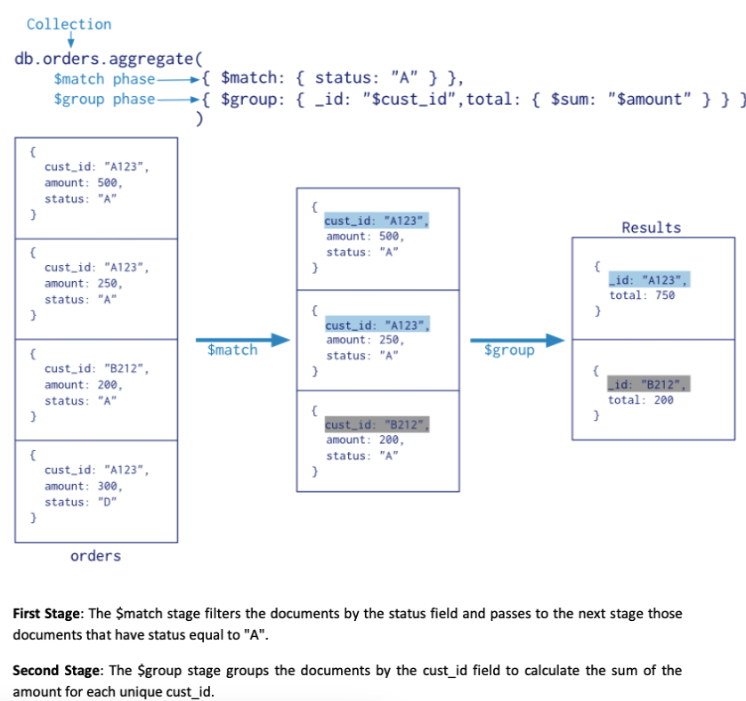

# 3.4. MongoDB

- [3.4. MongoDB](#34-mongodb)
  - [3.4.1 Introduction to MongoDB](#341-introduction-to-mongodb)
    - [Document Database](#document-database)
    - [Collections](#collections)
  - [3.4.2 MongoDB CRUD operations](#342-mongodb-crud-operations)
    - [Database](#database)
    - [CREATE](#create)
    - [READ](#read)
    - [UPDATE](#update)
    - [DELETE](#delete)
  - [3.4.3 Excersises](#343-excersises)
  - [3.4.4 Introduction](#344-introduction)
  - [3.4.5 Single Purpose Aggregation Operations](#345-single-purpose-aggregation-operations)
  - [3.4.6 Aggregation Pipeline](#346-aggregation-pipeline)
  - [3.4.7 Examples Zipcodes](#347-examples-zipcodes)
  - [3.4.8 Examples User Preference Data](#348-examples-user-preference-data)
  - [3.4.9 Pipeline Operations](#349-pipeline-operations)
  - [3.4.10 Excersises](#3410-excersises)
    - [Excersise 1](#excersise-1)
    - [Excersise 2](#excersise-2)
    - [Excersise 3](#excersise-3)
    - [Excersise 4](#excersise-4)

## 3.4.1 Introduction to MongoDB

### Document Database

- MongoDB -> Document Database
- JSON achtig
- Field - Value

FIELD: Value

```json
{
  "name": "John",
  "age": 25,
  "addresses": [
    {
      "street": "Main Street",
      "city": "New York"
    },
    {
      "street": "Broadway",
      "city": "New York"
    }
  ]
}
```

Voordelen documents:

- De documenten komen overeen met de objecten in de applicatie
- Embedded documents -> geen joins
- Dynamisch schema -> polymorfisme

### Collections

Hierarchie mongodb:
datanase > collection > document > field > key/value

Vergelijking met SQL:

| SQL           | MongoDB    |
| ------------- | ---------- |
| Database      | Database   |
| Table         | Collection |
| Row of record | Document   |
|               | Field      |
|               | Key/Value  |

Een collectie is te vergelijken met een tabel maar een collectie kan documenten bevatten met verschillend schema.

Elk document moet verplicht een `_id` bevatten.

MongoDB slaat de documenten op in BSON (Binary JSON). BSON binair formaat van JSON. (heeft meer types dan JSON)

## 3.4.2 MongoDB CRUD operations

### Database

Geruiken / aanmaken van een database: `use <database>`

NOTE: De database wordt pas aangemaakt als er een document in wordt opgeslagen.

Verwijderen van een database: `db.dropDatabase()`

### CREATE

Toevoegen nieuw document: `db.<collection>.insert(<document>)`

NOTE: Als de collectie nog niet bestaat wordt deze aangemaakt.

Sinds V3.2:

- 1 Toevoegen: `db.<collection>.insertOne(<document>)`
- Meerdere toevoegen: `db.<collection>.insertMany(<documents>)`

### READ

Alle documenten uit een collectie: `db.<collection>.find()`

Zoeken naar een document: `db.<collection>.find(<query>)`
BV `db.<collection>.find({name: "John"})`

NOTE: DE TYPES VAN DE QUERY MOETEN OVEREENKOMEN MET DE TYPES VAN DE DOCUMENTEN IN DE COLLECTIE. "1" is niet gelijk aan 1.

- \$gt: greater than: `db.<collection>.find({age: {$gt: 25}})`
  - leeftijd groter dan 25
- \$gte: greater than or equal: `db.<collection>.find({age: {$gte: 25}})`
  - leeftijd groter dan of gelijk aan 25
- \$lt: less than `db.<collection>.find({age: {$lt: 25}})`
  - leeftijd kleiner dan 25
- \$lte: less than or equal `db.<collection>.find({age: {$lte: 25}})`
  - leeftijd kleiner dan of gelijk aan 25

Je kunt deze ook combineren om een range te maken:

- `db.<collection>.find({age: {$gt: 25, $lt: 30}})`
  - leeftijd tussen 25 en 30

Zoeken op een object in een document: `db.<collection>.find({"object.key": value})` -> zelfde als javascript

- `db.<collection>.find({"addresses.city": "New York"})`

Wil je bepaalde velden niet of wel terug krijgen in de resultaten kun je een tweede parameter meegeven aan de find functie:

- `db.<collection>.find({<query>}, {name: 1, age: 1})`
  - 1: wel terug geven
  - 0: niet terug geven
  - \_id wordt altijd terug gegeven tenzij je deze expliciet uitsluit
- `db.<collection>.find({<query>}, {name: false, age: false})`

  - kan ook met true / false

- \$ne: not equal `db.<collection>.find({age: {$ne: 25}})`
  - leeftijd niet gelijk aan 25
- \$in: in `db.<collection>.find({age: {$in: [25, 30]}})`
  - leeftijd is 25 of 30
- \$nin: not in `db.<collection>.find({age: {$nin: [25, 30]}})`
  - leeftijd is niet 25 of 30
- \$or: or `db.<collection>.find({$or: [{age: 25}, {age: 30}]})`
  - leeftijd is 25 of 30
- \$nor: not or `db.<collection>.find({$nor: [{age: 25}, {age: 30}]})`
  - leeftijd is niet 25 of 30
- \$and: and `db.<collection>.find({$and: [{age: 25}, {name: "John"}]})`
  - leeftijd is 25 en naam is John
- \$all: all `db.<collection>.find({hobbies: {$all: ["sport", "music"]}})`
  - hobbies bevat sport en music
- \$exists: exists `db.<collection>.find({hobbies: {$exists: true}})`
  - documenten met een hobbies veld
- \$exists: exists `db.<collection>.find({hobbies: {$exists: false}})`

  - documenten zonder een hobbies veld

- Bij Arrays:
  - Object in array: `db.<collection>.find({"addresses.city": "New York"}`
    - zoekt naar een object in de array met street: "Main Street
  - \$size: size `db.<collection>.find({addresses: {$size: 2}})`
    - zoekt naar een array met 2 elementen

Regular expressions:


2 manieren:

- `db.<collection>.find({name: {$regex: /Jhon.*/i}})`

  - naam begint met John
  - i = case insensitive
  - / / = regular expression
  - . elk karakter behalve newline
  - \* 0 of meer
  - `db.<collection>.find({name: {$regex: "Jhon.*", $options: "i"}})`
  - `db.<collection>.find({name: /Jhon.*/i})`
  - alle 3 de manieren zijn hetzelfde
  - als je een regex en andere operators wilt combineren moet je de $regex gebruiken

- \$not: not `db.<collection>.find({name: {$not: /Jhon.\*/i}})`
  - naam begint niet met John
  - MOET EEN REGEX ZIJN
- \$ne: not equal `db.<collection>.find({name: {$ne: "John"}})`
  - naam is niet John

Je kunt javascript expressies gebruiken in de query met $where:

- `db.<collection>.find({$where: "this.name === 'John'"})`

  - Deze query gaat veel trager zijn dan de andere queries

- count: `db.<collection>.count({<query>})`
  - telt het aantal documenten die voldoen aan de query
  - query is optioneel
- limit: `db.<collection>.find({<query>}).limit(10)`
  - geeft de eerste 10 documenten terug die voldoen aan de query
  - query is optioneel
  - limit -> 0 = geen limiet
- skip: `db.<collection>.find({<query>}).skip(10)`

  - slaat de eerste 10 documenten over die voldoen aan de query
  - query is optioneel

- sort: `db.<collection>.find({<query>}).sort({name: 1})`
  - sorteert op naam
  - 1: oplopend chronologisch
  - -1: aflopend (reverse)
  - sorteren op meerdere velden: `db.<collection>.find({<query>}).sort({name: 1, age: -1})`
  - sorteren op een veld in een embedded document: `db.<collection>.find({<query>}).sort({"addresses.city": 1})`

### UPDATE

- `db.<collection>.update({<query>}, {<update>})`
  - update het eerste document dat voldoet aan de query
  - update is een document met de nieuwe waarden
  - update is een volledig document -> **HIER OVERSCHRIJF JE HET DOCUMENT MEE -> OPGELET**
- `db.<collection>.update({<query>}, {$set: {<update>}})`
  - door de set wordt het document **niet overschreven** maar worden enkel de velden die je meegeeft overschreven / toegevoegd
- multi: `db.<collection>.update({<query>}, {$set: {<update>}}, {multi: true})`
  - update alle documenten die voldoen aan de query
- Upsert: `db.<collection>.update({<query>}, {$set: {<update>}}, {upsert: true})`
  - als er geen documenten voldoen aan de query wordt er een nieuw document aangemaakt met de query en update

Versie 3.2:
NOTE: elke document manipulatie is een atomic operation

- updateOne:
  - `db.<collection>.updateOne({<query>}, {$set: {<update>}})`
  - update het eerste document dat voldoet aan de query
- updateMany:
  - `db.<collection>.updateMany({<query>}, {$set: {<update>}})`
  - update alle documenten die voldoen aan de query

Updaten arrays:

- `$push`: `db.<collection>.update({<query>}, {$push: {hobbies: "sport"}}`
  - voegt "sport" toe aan de array hobbies
- `$pull`: `db.<collection>.update({<query>}, {$pull: {hobbies: "sport"}}`
  - verwijdert "sport" uit de array hobbies
- `$pop`: `db.<collection>.update({<query>}, {$pop: {hobbies: 1}}`
  - verwijdert het laatste element uit de array hobbies
  - 1: laatste element
  - -1: eerste element
- `$unset`: `db.<collection>.update({<query>}, {$unset: {hobbies: ""}}`
  - verwijdert het veld hobbies uit het document

```
/* In case you want to delete a field from all the documents of a collection */
/* The false parameter is for upsert option, true is for multiple option.
We  set  multiple  option  to  true  because  we  want  to  delete  them  all  from  the
collection. */
db.comedy.update({},{$unset: {cast:1}}, false, true)
```

### DELETE

- `db.<collection>.remove({<query>})`
  - verwijdert 1 document dat voldoet aan de query

Versie 3.2:

- deleteOne:
  - `db.<collection>.deleteOne({<query>})`
  - verwijdert 1 document dat voldoet aan de query
- deleteMany:
- `db.<collection>.deleteMany({<query>})`
- verwijdert alle documenten die voldoen aan de query

HELE COLLECTIE LEGEN:

- `db.<collection>.remove({})`

VERWIJDEREN VAN EEN COLLECTIE:

- `db.<collection>.drop()`

## 3.4.3 Excersises

SOON

---

## 3.4.4 Introduction

Agregatie: het combineren van meerdere documenten tot 1 resultaat. (berekende resultaten)

MongoDB heeft hier 3 manieren voor:

- De Aggregation Pipeline
- Map-Reduce (deprecated) -> gaan we niet zien
- Single Purpose Aggregation Operations

## 3.4.5 Single Purpose Aggregation Operations

- count: `db.<collection>.countDocuments({<query>})`
  - telt het aantal documenten die voldoen aan de query
  - query is optioneel
  - countDocuments is accurater dan count
- distinct: `db.<collection>.distinct("name", {<query>})`
  - geeft een array terug met alle unieke waarden van het veld name
  - query is optioneel
  - kun je .length op uitvoeren om het aantal unieke waarden te krijgen

## 3.4.6 Aggregation Pipeline

Framework voor het uitvoeren van aggregatie operaties.

Werkt aan de hand van stages, elke stage voert een bepaalde operatie uit op de data.

`db.<collection>.aggregate([stage1, stage2, stage3, ...])`

bv:
`db.<collection>.aggregate([{$match: {name: "John"}}, {$group: {_id: "$age", count: {$sum: 1}}}])`

- $match: filtert de documenten die voldoen aan de query
- $group: groepeert de documenten op basis van een veld
  - \_id: het veld waarop gegroepeerd wordt
  - count: het aantal documenten in de groep (de 1 telt telkens 1 op)



Alles stages behalve: $out, $merge, $geoNear, $changeStream en $changeStreamSplitLargeEvent mogen meerdere keren voorkomen in de pipeline.

hele lijst van alle stages

| Stage                          | Description                                                                                                                                                                                                                               |
| ------------------------------ | ----------------------------------------------------------------------------------------------------------------------------------------------------------------------------------------------------------------------------------------- |
| `$addFields`                   | Adds new fields to documents. Reshapes each document by adding new fields to output documents, which contain both the existing fields and the newly added fields.<br>`$set` is an alias for `$addFields`.                                 |
| `$bucket`                      | Categorizes incoming documents into groups, called buckets, based on a specified expression and bucket boundaries.                                                                                                                        |
| `$bucketAuto`                  | Categorizes incoming documents into a specified number of groups (buckets) based on a specified expression. Bucket boundaries are automatically determined to distribute the documents evenly.                                            |
| `$changeStream`                | Returns a Change Stream cursor for the collection. This stage must be the first in the pipeline.                                                                                                                                          |
| `$changeStreamSplitLargeEvent` | Splits large change stream events (>16 MB) into smaller fragments in a change stream cursor.<br>Used only in a `$changeStream` pipeline as the final stage.                                                                               |
| `$collStats`                   | Returns statistics regarding a collection or view.                                                                                                                                                                                        |
| `$count`                       | Returns a count of the number of documents at this stage of the aggregation pipeline.<br>Distinct from the `$count` aggregation accumulator.                                                                                              |
| `$densify`                     | Creates new documents in a sequence where certain values in a field are missing.                                                                                                                                                          |
| `$documents`                   | Returns literal documents from input expressions.                                                                                                                                                                                         |
| `$facet`                       | Processes multiple aggregation pipelines within a single stage on the same set of input documents, enabling the creation of multi-faceted aggregations in a single stage.                                                                 |
| `$fill`                        | Populates null and missing field values within documents.                                                                                                                                                                                 |
| `$geoNear`                     | Returns an ordered stream of documents based on proximity to a geospatial point. Incorporates `$match`, `$sort`, and `$limit` for geospatial data. Output documents include a distance field and can include a location identifier field. |
| `$graphLookup`                 | Performs a recursive search on a collection, adding a new array field to each output document containing the traversal results.                                                                                                           |
| `$group`                       | Groups input documents by a specified identifier expression and applies accumulator expressions to each group. Outputs one document per distinct group.                                                                                   |
| `$indexStats`                  | Returns statistics regarding the use of each index for the collection.                                                                                                                                                                    |
| `$limit`                       | Passes the first `n` documents unmodified to the pipeline where `n` is the specified limit.                                                                                                                                               |
| `$listSampledQueries`          | Lists sampled queries for all collections or a specific collection.                                                                                                                                                                       |
| `$listSearchIndexes`           | Returns information about existing Atlas Search indexes on a specified collection.                                                                                                                                                        |
| `$listSessions`                | Lists all sessions that have been active long enough to propagate to the `system.sessions` collection.                                                                                                                                    |
| `$lookup`                      | Performs a left outer join to another collection in the same database to filter in documents for processing.                                                                                                                              |
| `$match`                       | Filters the document stream to allow only matching documents to pass unmodified into the next stage. Uses standard MongoDB queries.                                                                                                       |
| `$merge`                       | Writes the resulting documents of the aggregation pipeline to a collection. Can incorporate results into an output collection. Must be the last stage in the pipeline.<br>New in version 4.2.                                             |
| `$out`                         | Writes the resulting documents of the aggregation pipeline to a collection. Must be the last stage in the pipeline.                                                                                                                       |
| `$planCacheStats`              | Returns plan cache information for a collection.                                                                                                                                                                                          |
| `$project`                     | Reshapes each document in the stream, such as by adding or removing fields. Outputs one document for each input document.<br>See also `$unset` for removing fields.                                                                       |
| `$redact`                      | Restricts the content of each document based on information stored in the documents themselves. Incorporates `$project` and `$match`. Outputs one or zero documents for each input document.                                              |
| `$replaceRoot`                 | Replaces a document with a specified embedded document. Replaces all existing fields, including the `_id` field. Promotes the embedded document to the top level.<br>`$replaceWith` is an alias for `$replaceRoot`.                       |
| `$sample`                      | Randomly selects the specified number of documents from its input.                                                                                                                                                                        |
| `$search`                      | Performs a full-text search of the fields in an                                                                                                                                                                                           |
| `$searchMeta`                  | Returns metadata result documents for the Atlas Search query against an Atlas collection. Only available for MongoDB Atlas clusters running MongoDB v4.4.9 or higher.<br>Note: Not available for self-managed deployments.                |
| `$set`                         | Adds new fields to documents, similar to `$project`. Reshapes each document by adding new fields to output documents.<br>`$set` is an alias for `$addFields`.                                                                             |
| `$setWindowFields`             | Groups documents into windows and applies operators to the documents in each window.<br>New in version 5.0.                                                                                                                               |
| `$skip`                        | Skips the first `n` documents, where `n` is the specified skip number, and passes the remaining documents unmodified to the pipeline.                                                                                                     |
| `$sort`                        | Reorders the document stream by a specified sort key. Outputs one document for each input document.                                                                                                                                       |
| `$sortByCount`                 | Groups incoming documents based on the value of a specified expression, then computes the count of documents in each group.                                                                                                               |
| `$unionWith`                   | Performs a union of two collections, combining pipeline results from two collections into a single result set.<br>New in version 4.4.                                                                                                     |
| `$unset`                       | Removes/excludes fields from documents. An alias for `$project` stage that removes fields.                                                                                                                                                |
| `$unwind`                      | Deconstructs an array field from input documents to output a document for each element. Outputs `n` documents for each input document, where `n` is the number of array elements.                                                         |

## 3.4.7 Examples Zipcodes

Allemaal voorbeeldjes zie cursus

## 3.4.8 Examples User Preference Data

Allemaal voorbeeldjes zie cursus

## 3.4.9 Pipeline Operations

Chatgpt neemt ier fkes over

1. **\$match**: This operator is used to filter documents based on specified criteria. It's best practice to use \$match early in the pipeline to quickly reduce the number of documents processed by subsequent stages. Example: `db.zips.aggregate({$match: {state: "NY"}})`.

2. **\$project**: This operator allows you to select, exclude, or transform fields in the incoming documents. You can include or exclude fields, rename fields, and perform operations on them. For instance, `db.zips.aggregate({$project: {stateId: "$_id", _id: 0}})` renames the "\_id" field to "stateId".

3. **Mathematical expressions**: These include operations like \$multiply, \$divide, \$add, and \$subtract, allowing arithmetic manipulations of numeric fields in documents. For example, `{$project: {twicePop: {$multiply: ["$pop", 2]}}}` doubles the population value.

4. **Date expressions**: These are used for extracting and manipulating date fields, with operators like $year, $month, $dayOfMonth, etc.

5. **String expressions**: Operations like \$substr, \$concat, \$toLower, and \$toUpper are used to manipulate string fields. For example, `$concat` can merge multiple string fields into one.

6. **\$group**: This operator groups documents by specified fields and performs aggregations like sum, average, max, min, etc. For example, `db.zips.aggregate({$group: {_id: "$state", totalPop: {$sum: "$pop"}}})` calculates the total population per state.

7. **$unwind**: It's used to deconstruct array fields, creating a new document for each element in the array. It's useful for processing subdocuments in arrays, like comments in blog posts.

8. **$sort, $limit, $skip**: These operators control the ordering and the number of documents in the result. $sort orders the documents, $limit restricts the number of documents returned, and $skip skips a specified number of documents.

## 3.4.10 Excersises

Mussa goat

Volledige oef staan [hier](./mongodbOplossingDeel1.js)

### Excersise 1

```js
db.smartphones.find({price: { $gt: 400, $lt : 700}})

db.smartphones.find({'system.os': {$regex : /Android.*/i}})

db.smartphones.find({}, {name: true, price: true, review: true, _id: false}).sort({price: -1}).limit(1)

db.smartphones.update({name : {$regex: /Apple Iphone.*/i}}, {$set: {wifi: ['802.11b', '802.11g', '802.11n']}})

db.smartphones.find({name : {$regex: /Apple Iphone.*/i}})

db.smartphones.find({organizer: {$all: ["Phonebook", "Clock"]},  organizer: { $nin: ["Call list", "Calculator"] }})
```

### Excersise 2

```js
db.photoframes.find({$or: [{price: {$lt: 50}}, {"properties.screensize": {$lt: 20}}]})

db.photoframes.find({}, {_id: false, name: true, "properties.screensize": true }).sort({price: 1}).limit(1)

db.photoframes.find({reviews: { $exists: true, $not: { $size: 1 } }})

db.photoframes.find( {"memorycard": { $all: ["SDHC", "MMC", "xD"], $nin: ["MS", "CF"]}})

db.photoframes.updateMany({"properties.contrastratio" : {$nin: ["500:1", "600:1", "700:1"]}}, {'$set':{'remark':'Not available'}})
```

### Excersise 3

```js
//Give all laptops with a pruce between 500 and 1000 with a hard disk of 850 gb

db.laptops.find({$or:[{$and:[{price:{$gt:500}},{price:{$lt:1000}}]},{'properties.HD':'850GB'}]})

// Change windows 10 to Windows 11

db.laptops.updateMany({'properties.OS':'Windows 10'},{'$set':{'properties.OS':'Windows 11'}})

//Give name,price and operating System of the 2 cheapest Laptop

db.laptops.find({},{name:true,price:true,'properties.OS':true,_id:false}).sort({price:1}).limit(2)

//Give all laptops with at least 1 review with a score between 4 and 4.2
db.laptops.find({'reviews.score':{$gte:4,$lte:4.2}})

//Give all laptops with 2 USB 3_0 ports and that support at least 2 languages including dutch
db.laptops.find({$and:[{'properties.USB.USB3_0':2}, {LanguageOS:'Dutch'}, {$where: "this.LanguageOS.length>=2"}]})
```

### Excersise 4

```js
// 1. Give all irons of the brand Philips or Tefal that cost 30 euros or less, that are red, have a power of 2000 or more and have a cord storage space and spray function.
db.irons.find({$and:[{brand:{$in:['Philips','Tefal']}},{price:{$lte:30}},{'technically.power':{$gte:2000}},{extras:'spray function'},{extras:'cord storage space'}]})

// 2. Give the model, price and brand of the most expensive iron that is not red, weighing less than 2 kilos,
// that has at least 2 plus points, a maximum height of 20 centimeters and that does not have cord storage space as extra

db.irons.find({$and:[ {'description.color':{$not: {$regex:/red.*/i}}},{'technically.weight':{$lt:2}},{'reviews.plus':{$not:{$size:1}}},{'measures.height':{$lte:20}},{extras:{$ne:'cord storage space'}}]},{model:true,price:true,brand:true})
```
