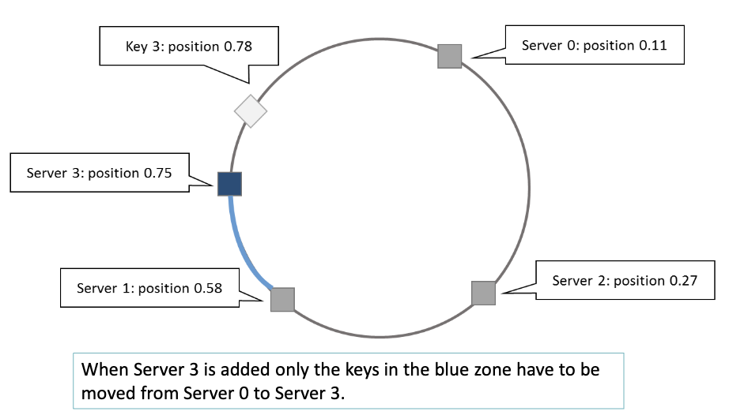
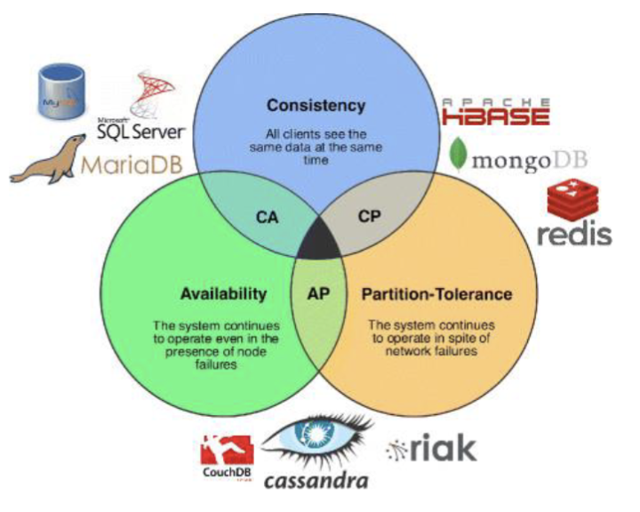
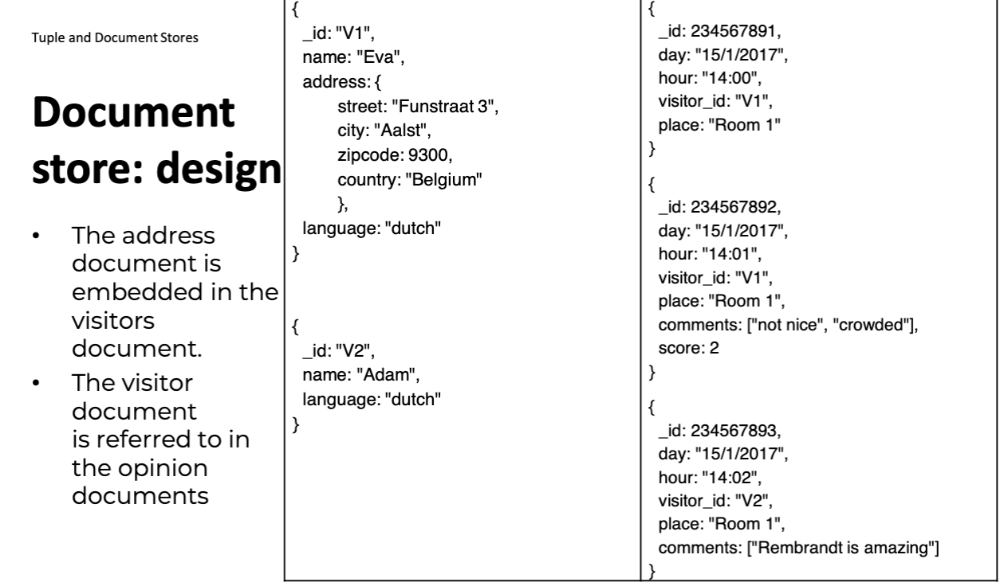

# 3.3. Types of NoSQL databases

- [3.3. Types of NoSQL databases](#33-types-of-nosql-databases)
  - [3.3.1. Key-Value Stores](#331-key-value-stores)
    - [Caching oplossing:](#caching-oplossing)
    - [NoSQL clusters](#nosql-clusters)
  - [3.3.2. Tupel and Document Stores](#332-tupel-and-document-stores)
    - [Tupel Store](#tupel-store)
    - [Document Store](#document-store)
    - [Items with keys](#items-with-keys)
    - [Filters and Queries](#filters-and-queries)
    - [MongoDB](#mongodb)
    - [SQL After ALL](#sql-after-all)
  - [3.3.3. Column Oriented](#333-column-oriented)
  - [3.3.4. Graph Databases](#334-graph-databases)

## 3.3.1. Key-Value Stores

- Data opgeslaan als een key-value pair.

  - Hashmap, hash table of dictionary.

- De key is een unieke identifier voor de value.
- De value kan een string, blob, JSON, XML, ... zijn.

Elke record mag dus een volledig ander data type en structuur hebben.

Het is de job van de applicatie om de data te interpreteren. De databank 'does not care'. Jij zegt gewoon tegen de databank ik wil deze data of dit opslaan maar de databank weet niet wat het is.

**Voorbeeld** Key-Value store: **Redis**

NoSQL is gemaakt met horizontal scaling in gedachte. Distribueren hashtabel over verschillende servers(opslag locaties).

Als je de hashes willen versprijden over 3 servers:

- index(hash) = mod(hash, nrServers) + 1
  - index(hash) = hash % nrServers + 1

### Caching oplossing:

- Memcached
  - implemneteerd een gedistribueerde geheugen gebaseerde key-value store die voor een SQL databank(mysql, mssql) staat om queries te cachen.
    -> VOORBEELD SLIDE 10

### NoSQL clusters

- Clustering:

  - groep servers samenwerken als 1 systeem

- Request coordination

  - Alle nodes hebben zelfde functionaliteit
  - geen MASTER node -> geen single point of failure
  - Alle nodes kunnen dus de coordinator zijn
  - Moet protocol zijn dat nodes weten van elkaar en voor faal detectie

- [Consistent hashing](https://www.youtube.com/watch?v=UF9Iqmg94tk) -> chinese goat

  - Consystent hashing wordt gebruikt om de data te verdelen over de nodes zodat er indien het aantal nodes veranderd de data niet te veel moet verplaatst worden.
  - ring-topologie -> representatie van alle hashes in een ring vorm
  - Elke key wordt gehashed en op de ring geplaatst.
  - Vervolgens wordt deze aan de eerste node toegekend die je tegenkomt als je de ring rond gaat in de klokzin.
  - 
  - Bij een goeie hashfunctie zal de verdeling per server ongeveer 1/n zijn.
  - Meeste keys zullen dus ook niet verplaatst moeten worden als er een node bijkomt of wegvalt.
  - 

- Replication and redundancy

  - Probleem consistent hashing: 2 nodes dicht bij elkaar -> 1 van de nodes zal veel meer keys hebben dan de andere.
  - Daarom worden nodes op meerdere plaatsen op de ring geplaatst. (replicas) -> dezelfde node op meerdere plekken voor betere spreiding.
  - != redundancy -> het is nog steeds dezelfde node maar op een andere plaats. Zelfde data dus. -> virtual node
  - Het is ook mogelijk een volledig redundante node te hebben. -> backup node

- Eventual consistency

  - Membership protocol kan niet garanderen dat elke node op de hoogte is van elke andere node.
  - Staat netwerk is niet consistent op elk moment. Maar het moet eventueel in een consistente state komen.
  - BASE principle <=> ACID:
    - Basicly Available
    - Soft state -> systeem veranderd over tijd zelfs als er geen input is
    - Eventual consistency
  - CAP theorem -> distributed system kan niet alle 3 de eigenschappen hebben op zelfde moment:
    - Consistency -> alle nodes zien zelfde data op zelfde moment
    - Availability -> elke request krijgt een response
    - Partition tolerance -> systeem blijft werken als er een node wegvalt of bijkomt
  - Meestal offeren nosql databases consistency op en streven voor eventueel consistent te zijn.
  - Consistency and availability -> voorbeeld slide 35

- Stabilizaton

  - De operatie die zorgt dat bij het toevoegen / verwijderen van een node de data op de juiste node komt te staan.
  - Consistent hashing schema? -> minimale data verplaatsing

- Integrity contrains and querying
  - Niet veel mogelijkheden om data te queryen -> bv put set
  - Geen relaties of schema
  - geen structuur
  - databank weet niks over de data
  - primary key access -> snel

## 3.3.2. Tupel and Document Stores

### Tupel Store

Zeer gelijkaardig aan key-value store maar hier wordt de unieke key opgeslaan en de bijhorende vector van waarden. (een referentie naar de data).

Schema loos -> geen structuur

Organiseren van gelijkaardige data -> groeperen met collecties

> Person:marc -> ("Marc", "McLast Name", 25, "Germany")
> Person:harry -> ("Harry", "Smith", 29, "Belgium")
> Painting:lamgods →(“Lam Gods”,”Van Eyck”,”Gent”)

### Document Store

Slaan een collectie van gelabelde attributen op. (JSON, XML, ...)
Semi-structured data

Tegenwoordig vaak JSON

### Items with keys

Document stores laten toe p te slaan in een collectie van gelabelde attributen maar moet een primaire key gespecifieerd worden.

Deze key wordt gebruikt als partition key om de data te verdelen en te weten waar de data opgeslaan is.

### Filters and Queries

Primairy key access -> snel

Maar meeste document stores laten ook toe om te filteren op andere attributen.

Kunt delen van een document ophalen en updaten.

Document databases zijn de meest gebruikte NoSQL databases. -> mongoDB en couchDB

### MongoDB

Meest bekende document store.

Sterk consistent by default -> als je data opslaat is het direct beschikbaar.

MongoDb is single master -> 1 node is verantwoordelijk voor het schrijven van data. (primary node)

Kunt kiezen voor secondairy node te lezen maar dan -> eventual consistency

### SQL After ALL

Filtering en queries zijn redelijk ingewikkeld in NoSQL databases.

Daarom gebruiken meeste NoSQL databases een SQL interface om queries te doen.

Whatever dit moet zijn?

> Many RDBMS vendors start implementing NoSQL by:
>
> Focusing on horizontal scalability and distributed querying.
> Dropping schema requirements.
> Support for nested data types or allowing to store JSON directly in tables.
> Support for GROUP BY like operations.
> Support for special data types, such as geospatial data.

## 3.3.3. Column Oriented

VOORBEELD:

If there are null fields in the data, the representation in a column-oriented database would reflect these nulls in the respective columns. Let's modify the previous example to include some null values:

**Row-Oriented Database with Null Values:**

| Book ID | Title                   | Author              | Published Year | Genre     |
| ------- | ----------------------- | ------------------- | -------------- | --------- |
| 1       | The Great Gatsby        | F. Scott Fitzgerald | 1925           | Novel     |
| 2       | 1984                    | George Orwell       | 1949           | Dystopian |
| 3       | To Kill a Mockingbird   | Harper Lee          | 1960           | Novel     |
| 4       | A Brief History of Time | Stephen Hawking     | (null)         | Science   |
| 5       | (null)                  | Agatha Christie     | 1934           | Mystery   |

**Column-Oriented Database with Null Values:**

**Column 1 - Book ID:**
| Book ID |
|---------|
| 1 |
| 2 |
| 3 |
| 4 |
| 5 |

**Column 2 - Title:**
| Title |
|------------------------|
| The Great Gatsby |
| 1984 |
| To Kill a Mockingbird |
| A Brief History of Time|
| (null) |

**Column 3 - Author:**
| Author |
|---------------------|
| F. Scott Fitzgerald |
| George Orwell |
| Harper Lee |
| Stephen Hawking |
| Agatha Christie |

**Column 4 - Published Year:**
| Published Year |
|----------------|
| 1925 |
| 1949 |
| 1960 |
| (null) |
| 1934 |

**Column 5 - Genre:**
| Genre |
|----------|
| Novel |
| Dystopian|
| Novel |
| Science |
| Mystery |

In this example:

- The "Published Year" for the book "A Brief History of Time" is null.
- The "Title" for one of Agatha Christie's books is unknown or not provided (represented as null).

In a column-oriented database, these null values would be handled according to the strategies mentioned earlier, like sparse storage, bitmap indexing, or run-length encoding. For example, the database might store the "Published Year" column using sparse storage or a bitmap index, efficiently representing the absence of a value for "A Brief History of Time". This approach allows for more efficient storage and querying, especially in scenarios where null values are common.

Handig als je vaak queries doet over grote hoeveelheiden gelijke data items.

Vak in combinatie met in-memory databases.

Voordelen:

- Agrergatie queries zijn snel -> group by
- null waarden zijn niet opgeslaan -> minder opslag
- SELECT met filtering kan direct worden uitgevoerd

Nadelen:

- JOINs zijn traag
- SELECT van 1 entity is traag

- Voorbeelden: Cassandra, Google BigTable, HBase, Parquet, ...

## 3.3.4. Graph Databases
