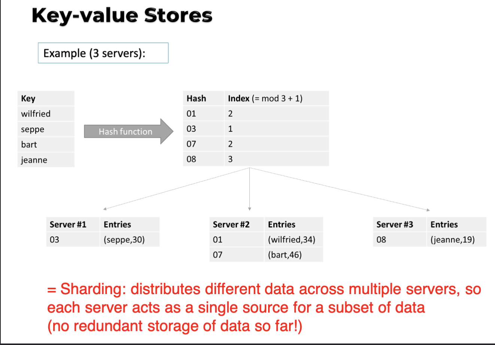

# 3.3. Types of NoSQL databases

## 3.3.1. Key-Value Stores

- Data opgeslaan als een key-value pair.

  - Hashmap, hash table of dictionary.

- De key is een unieke identifier voor de value.
- De value kan een string, blob, JSON, XML, ... zijn.

Elke record mag dus een volledig ander data type en structuur hebben.

Het is de job van de applicatie om de data te interpreteren. De databank 'does not care'. Jij zegt gewoon tegen de databank ik wil deze data of dit opslaan maar de databank weet niet wat het is.

**Voorbeeld** Key-Value store: **Redis**

NoSQL is gemaakt met horizontal scaling in gedachte. Distribueren hashtabel over verschillende servers(opslag locaties).

Als je de hashes willen versprijden over 3 servers:

- index(hash) = mod(hash, nrServers) + 1
  - index(hash) = hash % nrServers + 1

### Caching oplossing:

- Memcached
  - implemneteerd een gedistribueerde geheugen gebaseerde key-value store die voor een SQL databank(mysql, mssql) staat om queries te cachen.
    -> VOORBEELD SLIDE 10

### NoSQL clusters

- Clustering:
  - groep servers samenwerken als 1 systeem
    - Request coordination
      - Alle nodes hebben zelfde functionaliteit
      - geen MASTER node -> geen single point of failure
      - Alle nodes kunnen dus de coordinator zijn
      - Moet protocol zijn dat nodes weten van elkaar en voor faal detectie
    - [Consistent hashing](https://www.youtube.com/watch?v=UF9Iqmg94tk) -> chinese goat
      - ss
    - Replication and redundancy
    - Eventual consistency
    - Stabilizaton
    - Integrity contrains and querying

## 3.3.2. Tupel and Document Stores

## 3.3.3. Column Oriented

## 3.3.4. Graph Databases
