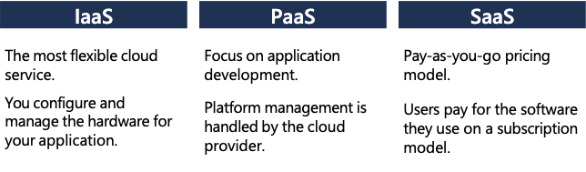
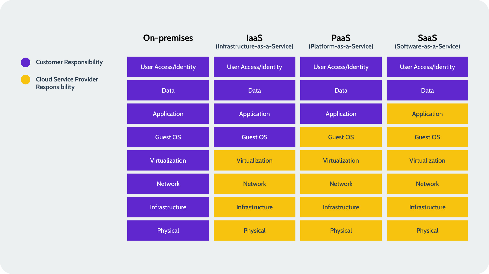

# 4. Cloud

- [4. Cloud](#4-cloud)
  - [4.1. Cloud Models](#41-cloud-models)
    - [Define cloud computing](#define-cloud-computing)
    - [Describe Public cloud](#describe-public-cloud)
    - [Describe Private cloud](#describe-private-cloud)
    - [Describe Hybrid cloud](#describe-hybrid-cloud)
  - [4.2. Cloud benefits and considerations](#42-cloud-benefits-and-considerations)
    - [Cloud benefits](#cloud-benefits)
    - [Compare CapEx and OpEx](#compare-capex-and-opex)
    - [Consumption-based model](#consumption-based-model)
  - [4.3. Cloud services](#43-cloud-services)
    - [Infrastructure as a Service (IaaS)](#infrastructure-as-a-service-iaas)
    - [Platform as a Service (PaaS)](#platform-as-a-service-paas)
    - [Software as a Service (SaaS)](#software-as-a-service-saas)
    - [Identify a service type based on a use case](#identify-a-service-type-based-on-a-use-case)
    - [Shared responsibility model](#shared-responsibility-model)
  - [4.4. Cloud Databases](#44-cloud-databases)
    - [What is a cloud database?](#what-is-a-cloud-database)
    - [Cloud (Database) Providers](#cloud-database-providers)
  - [4.6. Azure en Microsoft verkoopspraatje van de bovenste plank (Data on Ms Azure)](#46-azure-en-microsoft-verkoopspraatje-van-de-bovenste-plank-data-on-ms-azure)
  - [4.7. Snowflake](#47-snowflake)

## 4.1. Cloud Models

### Define cloud computing

**Cloud computing** is het leveren van computing services (servers, storage, databases, networking, software, analytics, intelligence, etc.) over het internet (the cloud) om sneller te innoveren, resources te schalen en flexibiliteit te bieden.

### Describe Public cloud

- **Public cloud**
  - Aangeboden door externe partij (Hosting provider)
  - Levert middelen en diensten aan meerdere eindegebruikers (bedrijven, organisaties, individuen)
  - Toegang via een beveildigde internetverbinding
  - Enkel betalen voor wat je gebruikt
  - Kan applicatie snel voorzien worden van extra resources
  - Geen upfront kost voor aankoop en onderhoud van eigen hardware

### Describe Private cloud

- **Private cloud**
  - Cloud omgeving door bedrijf zelf beheerd (eigen datacenter)
  - Geen toegang voor andere bedrijven, organisaties of individuen
  - Bedrijf is zelf verantwoordelijk voor service
  - BV: VIC op de HoGent, Elk bedrijf met eigen datacenter voor eigen gebruik
  - Zelf hardware aankopen en onderhouden
  - Volledige controle over resources en beveiliging
  - Zelf verantwoordelijk voor onderhoud

### Describe Hybrid cloud

- **Hybrid cloud**
  - Combinatie van public en private cloud
  - Laat bedrijf toe te kiezen bepaalde applicaties/services in public cloud te plaatsen en andere in private cloud
  - Bedrijf kan bv. eigen datacenter hebben voor eigen gebruik, maar kan ook gebruik maken van public cloud voor bepaalde services
  - Meest flexibele oplossing
  - Bedrijf controleert zelf de veiligheid, compliance of bepaalde legale vereisten

## 4.2. Cloud benefits and considerations

### Cloud benefits

1. **Hoge beschikbaarheid (High availability)**: Constante toegang tot cloud services, zelfs bij storingen.
2. **Schaalbaarheid (Scalability)**: Eenvoudig aanpassen van IT-resources aan veranderende behoeften.
3. **Elasticiteit (Elasticity)**: Automatische aanpassing van resources aan actuele vraag.
4. **Wendbaarheid (Agility)**: Snel nieuwe technologieën implementeren en innovaties doorvoeren.
5. **Wereldwijd bereik (Global reach)**: Snelle en efficiënte service dicht bij eindgebruikers wereldwijd.
6. **Fouttolerantie (Fault tolerance)**: Minimaliseren van uitval en dataverlies door redundante systemen.
7. **Capaciteiten voor klantenlatentie (Customer latency capabilities)**: Door gebruik te maken van geografisch verspreide datacenters kunnen cloudproviders lagere latentietijden bieden, wat betekent dat er minder vertraging is in de interactie tussen de gebruiker en de applicatie, wat vooral belangrijk is voor real-time applicaties.
8. **Voorspelbare kostenoverwegingen (Predictive cost considerations)**: Betere budgetbeheersing door pay-as-you-go betalingsmodellen.

### Compare CapEx and OpEx

- **CapEx (Capital Expenditure)**:

  - Upfront kosten voor aankoop van hardware en software.
  - Kosten van CaoEx hebben een waarde die in de loop van de tijd afneemt.

- **OpEx (Operational Expenditure)**:
  - Kosten voor het gebruik van de hardware en software.
  - Kosten van OpEx zijn meestal recurrent.

Verschil tussen deze twee is gewoon dat CapEx 'eenmalige' kosten zijn en OpEx recurrente kosten. Bij CapEx zal ook af en toe een upgrade moeten gebeuren, wat ook weer een CapEx kost is. OpEx laat minder verassingen toe.

### Consumption-based model

Cloud diensten betaal je op basis van wat je effectief gebruikt. Dit levert volgende voordelen op:

- Betere kost inschatting
- Afreking gebaseerd op effectie gebruikt
- Je weet de prijs op voorhand

## 4.3. Cloud services

### Infrastructure as a Service (IaaS)

- **IaaS**:
  - pay-as-you-go model
  - Geen aankoop van eigen hardware nodig
  - koopt toegang tot servers, storage, netwerken, etc.
  - Je bent zelf verantwoordelijk voor installatie en onderhoud van software je 'huurt' puur de fysieke infrastructuur

### Platform as a Service (PaaS)

- **PaaS**:
  - pay-as-you-go model
  - voorzien van hardware en software tools
  - ze voorzien een 'platform' waarop je je eigen applicaties kan bouwen

### Software as a Service (SaaS)

- **SaaS**:
  - pay-as-you-go model
  - volledig afgewerkte applicaties
  - je hoeft zelf geen hardware, software of infrastructuur te beheren
  - je kan de applicatie gewoon gebruiken
  - BV: Office 365, Google Apps, Salesforce, etc.
  - Vaak met een abbonement

### Identify a service type based on a use case

### Shared responsibility model

## 4.4. Cloud Databases

### What is a cloud database?

- **Cloud database**:
  - Database die in de cloud draait (duh)
  - geleverd door de public of private cloud provider
  - data managed op cloud storage
  - deze systemen zijn ontworpen om verschillende applicaties te ondersteunen zoals transactionele, analytische workloads, deep learning en data warehousing

### Cloud (Database) Providers

- **Cloud providers**:
  - **Microsoft Azure**
  - [**Snowflake cloud database**](#45-snowflake)
  - Amazon Web Services (AWS)
  - Google Cloud
  - IBM
  - Oracle Cloud Architecture (OCI) -> dure vogels
  - Alibaba
  - etc.

## 4.6. Azure en Microsoft verkoopspraatje van de bovenste plank (Data on Ms Azure)

## 4.7. Snowflake

- defacto standaard voor cloud datawarehousing
- Dataplatform en datawarehouse dat SQL ondersteunt
- Cross-cloud platform

Wordt vervolgd :)
TODO: Finish this
