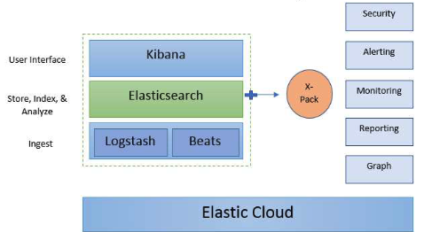

# 5. Elasticsearch

- [5. Elasticsearch](#5-elasticsearch)
  - [5.1. Wat is Elasticsearch?](#51-wat-is-elasticsearch)
  - [5.2. Key components of Elasticsearch](#52-key-components-of-elasticsearch)
  - [5.3. Often as part of a pipeline](#53-often-as-part-of-a-pipeline)
  - [5.4. Quick start](#54-quick-start)
  - [5.5. Use cases](#55-use-cases)
  - [5.6. Elasticsearch vs. OpenSearch](#56-elasticsearch-vs-opensearch)
    - [Elasticsearch](#elasticsearch)
    - [OpenSearch](#opensearch)
  - [5.7. Demo](#57-demo)

## 5.1. Wat is Elasticsearch?

- distributed document store
- zoek en analyse engine
- kan schema loos

Doel: zo goed als real time zoeken en analyseren ingrote hoeveelheden gestructureerde en ongestructureerde data

JSON documenten

In cluster?

- opgeslagen documenten worden verdeeld over verschillende nodes (distributed)

Maakt gebruik van **inverted index** dat zorgt voor snel full text zoeken

- Inverted index: een index van woorden en waar ze voorkomen in de documenten

Index -> geoptimaliseerde collectie van documenten

Default: Alle data en elke veld wordt geïndexeerd en heeft een eigen gedediceerde inverted index

```
For example, text fields are stored in inverted indices, and numeric and geo
fields are stored in BKD trees. The ability to use the per-field data
structures to assemble and return search results is what makes
Elasticsearch so fast.
```

```
_In the CAP theorem, Elasticsearch falls into the AP category of the CAP
theorem, which prioritizes availability and partition tolerance over
consistency. In other words, in the event of a network partition or node
failure, Elasticsearch will prioritize returning results quickly and ensuring
that the system remains available over providing strong consistency
guarantees. However, Elasticsearch still ensures eventual consistency,
meaning that updates to data are eventually propagated to all nodes in the
cluster._
```

## 5.2. Key components of Elasticsearch

ELK stack (Elasticsearch, Logstash, Kibana)

- Real time seach and analytics at scale

- UI: Kibana
- Opslaan, indexeren en analyseren: Elasticsearch
- Ingest van data: Logstash of Beats



## 5.3. Often as part of a pipeline

## 5.4. Quick start

- Niew iets maken

  - `POST books/_doc {"name": "Snow Crash", "author": "Neal Stephenson", "release_date": "1992-06-01", "page_count": 470}`

- Zoek alle documenten van iets

  - `GET books/_search`

- Zoek iets specifiek
  - `GET books/_search {"query": {"match": {"name": "Snow Crash"}}}`

## 5.5. Use cases

Tot iedereens grootste verbazing: ZOEKEN

Goed als zoekoperaties, ophalen en raportering belangrijk zijn

- Logging in applicaties
- E-commerce
- Security events (SIEM) -> Security Information and Event Management
  - ELK stack
  - Opensearch / Wazuh
    - 100% open-source search and analytics suite used for a broad set of use cases like real-time application monitoring, log analytics, and website search.
    - Wazuh open-source security analytics platform

## 5.6. Elasticsearch vs. OpenSearch

### Elasticsearch

Oorspronkelijk Apache licentie(permissive open source license), maar Elastic NV heeft de licentie aangepast naar SSPL (Server Side Public License). Deze licentie legt restricties op aan cloud providers. (Deze licentie is gelijk aan die van mongoDB)

### OpenSearch

Elasticsearch geforked door Amazon Web Services (AWS) en hernoemd naar OpenSearch. Dit omdat Elastic NV de licentie had zitten aanpassen.

## 5.7. Demo

Bla bla bla cool cool
