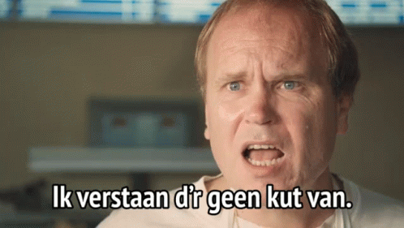

# Samenvatting (niet zo) Modern Data Architectures

Jow gasten,

Samenvatting van het vak (niet zo) Modern Data Architectures (2023-2024) aan de Hogeschool Gent.

Groetjes, Jasper

## Inhoudsopgave

### [1. Database Apis](./1%20Database%20APIs/index.md)

### [2. Advanced Performance](./2%20Advanced%20performance/index.md)

### [3. NoSQL](./3%20NoSql/index.md)

### [4. Cloud](./4%20Cloud/index.md)

### [5. Elastic Search](./5%20Elastic%20Search/index.md)

### [6. Vector Databases](./6%20Vector%20Databases/index.md)
